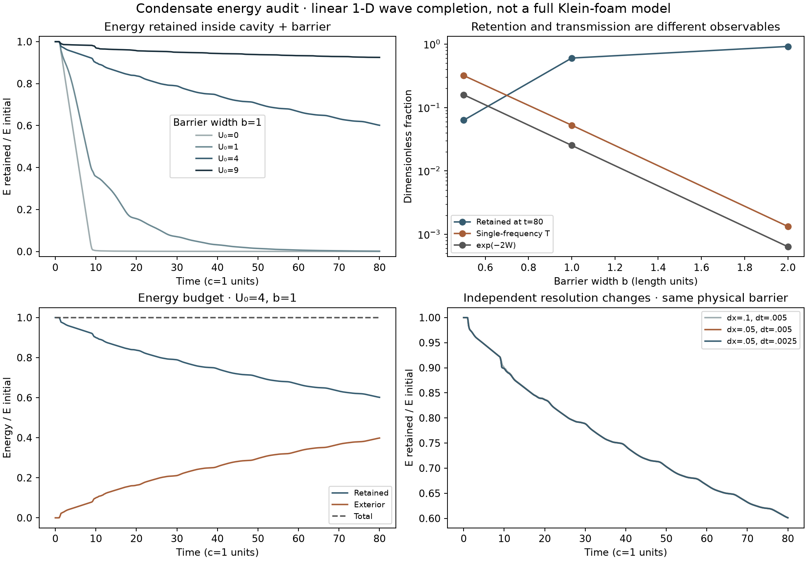
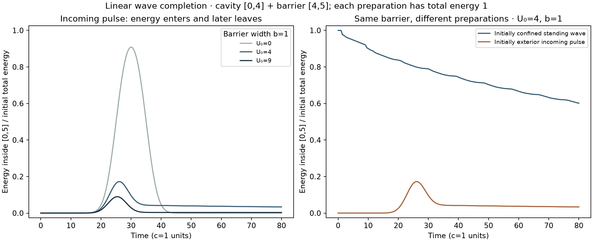

# Klein-foam mass proposal: retained energy, entry and escape

2026-09-23. **The tested model supports geometry-dependent, temporary energy
localization. It does not support identifying a barrier's transmission factor
with the amount of energy retained, independently of preparation and time.**
An entry/capture interpretation remains possible but requires its own dynamics.
The experiment also resolves the spatial transfer-matrix coefficient convention.

This is an explicitly added linear wave completion of the source's stationary
barrier equation. It is not a simulation of the full nonlinear Klein foam, an
observation of a physical condensate, or a derivation of particle rest mass.
No manuscripts, old solver functions, standing rules or previous conclusions
were overwritten. Initial calibration failures are retained.

## Connection to the actual proposal

The canonical `papers/notes/Klein_Foam_Monad.tex` postulates a flag condensate,
twisted throats and phase slips, and identifies residual confined energy with
mass through

\[
m=\delta E_{\rm condensate}/c^2,\qquad \delta\approx e^{-2W}.
\]

Its companion `Flag_Condensate_Nuclear_Decay.tex` supplies allowed/forbidden
stationary propagation matrices. It does not supply a closed nonlinear action
and evolving throat/gluing rules for the entire foam. We therefore specify the
additional time evolution, rather than silently inventing one and claiming it
is the unique intended model:

\[
\partial_t^2\Phi=\partial_x^2\Phi-U(x)\Phi,
\quad
e=\tfrac12(|\partial_t\Phi|^2+|\partial_x\Phi|^2+U|\Phi|^2),
\quad J=-\operatorname{Re}(\overline{\partial_t\Phi}\,\partial_x\Phi).
\]

Here U>=0 is an externally prescribed, static barrier; c=1 and all units are
dimensionless. Phi is a classical complex field. Its independent velocity is
not equated with the manuscript's imaginary component pi. This is a choice of
Hamiltonian dynamics, not a quantization of that component convention.
For Phi=u(x) exp(−i omega t), the equation reduces to u''=(U−omega²)u, giving
exactly the allowed/forbidden matrix *form* used in the source. Equating the
source's quantum energy parameter and this wave frequency is not assumed.

The conservation law follows directly by differentiation: e_t+J_x=0. We measure
this energy and its current, rather than substituting a probability norm and
calling it energy. Positive energy bounds perturbations of this linear model;
the imposed walls and potential still provide confinement externally.

## Findings from time evolution

The cavity is [0,4], with barrier [4,4+b] and a long exterior. Start with a
standing-wave profile inside, zero field outside, and total discrete energy
normalized to one. No renormalization, damping or absorber is applied afterward.
The initially truncated profile is broadband; a single-frequency transmission
coefficient is only a comparison instrument, not its entire spectral content.

At barrier height U0=4 and the fixed measurement time t=80:

- Width b=0.5: **6.30%** remains in cavity+barrier; reference T=31.92%;
  exp(−2W)=15.89%.
- Width b=1: **60.16%** remains; reference T=5.256%; exp(−2W)=2.526%.
- Width b=2: **91.74%** remains; reference T=0.1331%; exp(−2W)=0.06379%.

The reference frequency is omega=pi/4; W=b sqrt(U0−omega²). Increasing this
barrier's width reduces transmission while increasing retention over the tested
time interval. This rejects a universal equality between those observables for
this specified preparation. It does not exclude an exponential factor in a
specified loading, escape-rate, capture or phase-slip calculation.

The central case retains 92.77%, 81.07%, 71.33% and 60.16% at t=8,24,48,80.
Thus even with geometry fixed, the retained fraction changes with time.
For U0=9,b=2, 96.75% remains at t=80, but finite-time localization does not prove
an eternal bound state. The barrier-free control has only 0.0266% left at t=80;
that small dispersive finite-grid tail is not evidence for newly generated mass.



In the upper-right panel, U0=4 is fixed. T and exp(−2W) are monochromatic
quantities at omega=pi/4, while retained energy comes from the specified
broadband preparation. The other panels label their barrier conditions.

## Reverse direction: entry is not permanent capture

To avoid treating the initially occupied cavity as the only possible reading of
“slag,” a separately registered supplement sends a Gaussian wave from outside
toward the same cavity and barrier. Its center is x=30, envelope sigma=4 and
carrier pi/4; actual initial field energy again equals one.

For U0=4,b=1, energy inside the cavity+barrier reaches **17.22%** at t=26.2 and
falls to **3.366%** by t=80. Refinement gives peak **17.53%** and late **3.363%**.
For U0=9,b=1, the corresponding coarse-grid values are 8.974% and 0.3277%.
Without a barrier, the region temporarily contains 90.85% as the pulse passes
and reflects from the left wall; almost none remains at t=80.

“Inside” includes near-field energy in the barrier, so these peaks are not
automatically a bound-state population. The signed outward flux becomes
negative during entry and accounts for that energy increase. The pulse is
broadband and the cavity can reflect coherently; its peak cannot be equated
with T at one frequency. No irreversible capture mechanism was added.



These two preparations use the same central barrier and total initial energy,
but different spatial and spectral states. The results demonstrate that a
barrier parameter alone does not determine the later localized energy.

## Which transfer coefficient is which?

We fix the convention rather than assuming a name transfers between domains.
Let M propagate (u,u') from the left barrier face to the right and C have columns
(1,ik) and (1,−ik). With equal exterior wave number k,

\[
B=C^{-1}MC,\qquad
\binom{t}{0}=B\binom{1}{r},\qquad
\alpha=B_{22},\quad \beta=B_{21}.
\]

Then r=−beta/alpha and t=1/alpha because det B=1. Consequently

\[
T=1/|\alpha|^2,\qquad R=|\beta/\alpha|^2,\qquad R+T=1.
\]

All 180 stationary cases agree with independent ODE propagation and boundary
matching. A zero barrier has T=1 and beta=0, directly distinguishing the two
coefficients. At the threshold U=omega², width2 and omega1 give T=1/2 even though
the bare WKB exponential equals1: the exponential is not an exact universal
transmission law, particularly outside its opaque-barrier regime.

This checks a **spatial scattering convention**. A time-dependent quantum
Bogoliubov transformation or Hawking mode relation uses additional physical
definitions. The result does not declare every quantity called beta to be a
reflection amplitude; it establishes that the printed spatial transmission
formula and the ratio |beta/alpha|² cannot be identified under the convention
above without a different map. For background on the plane-wave/wavepacket
distinction and barrier resonances, see
[MIT's resonance and S-matrix lecture](https://ocw.mit.edu/courses/8-04-quantum-physics-i-spring-2013/resources/lecture-14/).

## What survives from the previous condensate work

The existing exact script `test_conjecture_condensate_collapse.py` was rerun;
its output reports all four algebraic subclaims surviving. The log is retained:
the sl(4,R) adjoint flow has eigenspaces of dimensions 3,9,3 at eigenvalues
+4/3,0,−4/3; generic directions align projectively with the growing sector;
that sector is abelian with pairwise zero products and maps the lepton basis
direction into the three quark directions in the chosen representation.
The exceptional set for the dominant alignment is V0+V−, not just V0.

This is compatible with the earlier failure of a closing rotational condensate:
**a normalized direction can converge while its unnormalized magnitude grows.**
Projective alignment and finite-energy localization are different assertions.
Neither this rerun nor the new wave calculation establishes quantum matter,
rest mass, or the physical interpretation of those representation labels.

## Concrete correction to the framework's observable

For the present instrument, use a region- and preparation-dependent observable:

\[
\delta_{\mathcal R}(t;\Phi_0,\dot\Phi_0,U,\mathrm{BC})
=E_{\mathcal R}(t)/E_0,
\qquad
\delta_{\mathcal R}(t)=\delta_{\mathcal R}(0)
-\frac1{E_0}\int_0^t J_{\rm outward}(\tau)\,d\tau.
\]

This definition allows entry (negative outward current), storage and release
to be tracked separately. It is a measurement contract, not a new dynamical law.
Dividing E_R by c² defines an energy-equivalent mass proxy; it does not derive
inertial mass or show that the system confines itself. A full mass mechanism
needs an action and an energy account for the walls/substrate, a selected
localized state, and its stability or lifetime.

If an incoming fraction T is meant to become retained “slag,” specify what
prevents or controls its subsequent escape: for example a derived change of
boundary conditions, a nonlinear localized mode or an energy-transfer channel.
Those are possible modeling branches, not mechanisms verified here. Simply
renaming transmission as retained mass skips that step. Conversely, this test
does not justify replacing delta by 1−T universally; reflection, transmission
and finite-time storage are distinct quantities.

## Verification and practical limits

The successful outputs contain **19 grouped checks**, 180 stationary grid
cases, 19 main dynamic variants and four incoming variants, plus three separate
time-solver/closed-cavity controls. Main-run maxima:

- Analytic versus independently integrated stationary T: 3.60e−13 absolute.
- R+T−1: 6.67e−16 absolute.
- Total field-energy drift: 6.33e−12 relative.
- Regional energy versus integrated edge flux: 4.76e−12 of initial energy.
- Global phase rotation effect: 7.22e−15 in retained fraction.
- Selected combined space/time refinement: 0.00885 maximum absolute retained
  fraction, below the predeclared 0.02 gate. This is a finite convergence check,
  not a rigorous continuum error bound.
- Central spatial-only change: 0.00877; additional time refinement: 0.0000775.
- D=120 versus D=160 central confined case: no difference at reported precision.
- A 0.01i second-mode perturbation changes retention by at most 0.001303;
  its difference-field energy is conserved. A smoothed physical barrier changes
  retention by up to 0.01492; that is model sensitivity, not solver error.

The local conservation test uses the independently accumulated **discrete**
current corresponding to the finite-difference Hamiltonian and midpoint rule.
Both total and local conservation can be exact for an inaccurate phase evolution,
which is why the independent time-solver and refinement tests are also required.

The initial midpoint calibration failed at coarse steps (0.1229 and 0.07160
relative energy-norm state error). Reducing steps gave 0.004877 and 0.001221
against DOP853. The original protocol, source and failed results remain in
`attempt-1/`. The incoming supplement initially missed the exterior tail gate
by a small amount (1.41857e−8 versus1e−8); widening the exterior to160 passed
without weakening the threshold. Its earlier record remains in
`capture-attempt-1/`. `failed-checks.json` is the latest historical failure,
not the status of the final result files.

## Reproduce

From the ACS-Framework-threshold-audit repository root:

```sh
/private/tmp/acs-threshold-20260920-venv/bin/python code/condensate_energy/run.py
/private/tmp/acs-threshold-20260920-venv/bin/python code/condensate_energy/capture.py
/private/tmp/acs-threshold-20260920-venv/bin/python code/condensate_energy/plot_capture.py
```

Dependencies are Python, NumPy, SciPy, Matplotlib and SymPy (for the existing
algebraic replay). Exact versions, source hashes, trajectories and checks are
in `results.json`, `capture-results.json` and `checks.json`. The two protocol
files record original settings and explicit calibration amendments. This is a
simulation and internal model audit; no new experimental physical data were used.
