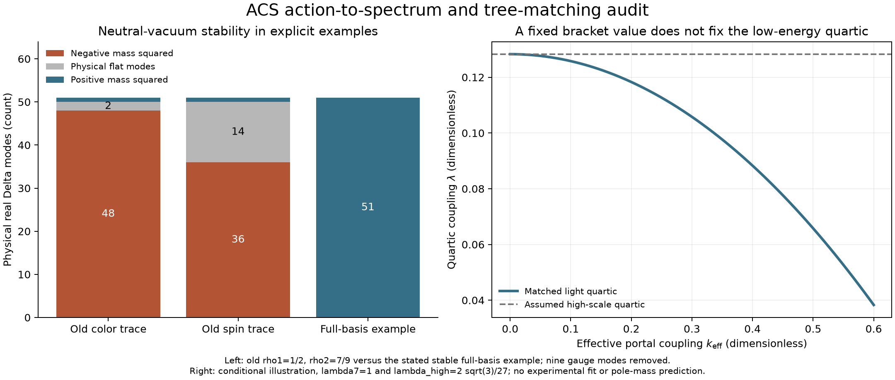

# From the ACS action to masses and the low-energy quartic

The next source audit produces two concrete results. **The old positive-rho2
parameter range destabilizes the proposed first-stage neutral vacuum under both
explicit trace interpretations.** A corrected calculation also supplies the
**tree-level matching formula** between the complete scalar potential and a
selected light Higgs doublet. There are 81 passing checks across the spectrum,
matching, and orbit-bound calculations.

This extends the [radiative-closure audit](../hidden_couplings/README.md). It does
not derive physical boundary couplings, a matching scale, or a Higgs pole mass.
The broader investigation remains active.



## The mass pairing was an assumption at its source

In [Phase 8](source-snapshots/phase8_full_qfp.py), lines 177–185 require a scalar
mass to equal a gauge-boson mass and insert the expressions
\(m_A^2=g^2v_R^2\) and \(m_S^2=(2\rho_1+\rho_2)v_R^2+O(v^2)\).
The script does not compute either from the complete kinetic action and scalar
Hessian. Its approximate ten-coupling beta system also predates the complete
17-invariant action. Later [parameter prose](source-snapshots/task_A_parameters.py)
quotes that equation as a geometric constraint.

We tested the missing spectrum directly. Work in the already declared canonical
minimal model, with

\[
\Phi=0,\quad (D_1,D_2,D_3)=\frac{d}{\sqrt2}(1,-i,0)E_{44},
\quad N_\Delta=d^2,\quad m_\Delta=-2\lambda_7d^2.
\]

Here mDelta is the coefficient of NDelta, not its square root; invariant indices
are zero-based. This is the first breaking stage, before electroweak symmetry
breaking. The exact gauge masses squared, divided by d squared, are

- g4 squared, six vector modes;
- gR squared, two vector modes;
- 3 g4 squared + 2 gR squared, one vector mode;
- zero, twelve unbroken gauge directions.

Thus the color/lepton gauge-boson formula is recovered in the canonical convention.
The scalar sector has 60 real Delta coordinates, nine gauge Goldstones and
51 remaining physical directions. Their masses are as follows, each divided by
\(d^2\); the number in parentheses is the real multiplicity:

\[
\begin{aligned}
(\bar6,-4/3):&\quad \tfrac43(\lambda_9-\lambda_7) &&(12),\\
(\bar6,-1/3):&\quad \lambda_{10}+\tfrac23\lambda_9-\tfrac53\lambda_7 &&(12),\\
(\bar6,+2/3):&\quad \tfrac19(9\lambda_{10}+2\lambda_6-17\lambda_7+4\lambda_8+2\lambda_9) &&(12),\\
(\bar3,+1/3):&\quad \lambda_{10}-\lambda_7 &&(6),\\
(\bar3,+4/3):&\quad \tfrac13(3\lambda_{10}+2\lambda_6-5\lambda_7) &&(6),\\
(1,+2):&\quad \tfrac43(\lambda_6-\lambda_7) &&(2),\\
(1,0)\text{ radial}:&\quad 4\lambda_7 &&(1).
\end{aligned}
\]

Labels give SU(3) color and hypercharge. All seven expressions must be positive
for a strictly positive physical Delta Hessian. Phi's eight real modes are
handled separately below. The holomorphic pair has no Hessian at this rank-one
vacuum, although it affects interactions and can affect global boundedness.

This is an exact diagonalization: 60 independent generalized eigenvectors were
checked against every coupling-dependent Hessian separately. The gauge orbit is
annihilated by the stationary Hessian. A separate NumPy evaluation of the original
polynomials reproduces the spectrum.

## Why the old range fails, despite a bounded potential

For the explicit color-Gram reading A of the old rho2 trace, the color-triplet
hypercharge-1/3 mass is \(-\rho_2d^2\). For the spin-Gram reading C it is
\(-2\rho_2d^2\). Consequently,

\[
0<\rho_1<8/9,\qquad \rho_2=16/9-2\rho_1
\quad\Longrightarrow\quad m^2_{\bar3,1/3}<0
\]

throughout the old stated interval. This is a physical transverse direction,
not an eaten gauge mode. At rho1=1/2, the color-Gram model has 48 negative,
11 zero and one positive Delta eigenvalues; the spin-Gram model has 36 negative,
23 zero and one positive. Nine of each model's zeros are gauge directions.

The problem is vacuum orientation, not an unbounded quartic. Exact Gram-eigenvalue
bounds give

\[
\tfrac14\le A/N_\Delta^2\le1,\qquad
\tfrac13\le C/N_\Delta^2\le1.
\]

Actual Delta matrices attain both endpoints. The old neutral configuration
saturates the upper endpoint. Positive rho2 favors spreading the norm into the
lower endpoint. Both candidate potentials are bounded for positive rho1 and
rho2, yet have lower-energy nonneutral configurations at the same action parameters.
The [exact orbit-bound evidence](orbit-bounds.json) includes those configurations.

Sharp conditions for a strictly positive pure-Delta quartic are
\(\rho_1+\rho_2>0\) together with \(\rho_1+\rho_2/4>0\) for A, or
\(\rho_1+\rho_2/3>0\) for C. Along the proposed source relation, a negative
rho2 instead favors the neutral rank-one orbit when \(8/9<\rho_1<16/9\).
Even there the two-trace ansatze retain extra flat directions, including the
doubly charged singlet, because both enforce lambda6=lambda7.

Every transverse mass is unchanged by adding the same constant to all five
Delta norm couplings and retuning mDelta to maintain the same vacuum. Equivalently,
the coefficient of the isotropic NDelta squared term cancels out of every
transverse mass. No scalar eigenvalue in either explicit two-trace model is
identically the claimed \((2\rho_1+\rho_2)d^2\). The old scalar-generator name
does not supply the missing identification with a physical Delta mode.

These statements concern the stated first-stage canonical model and two explicit
trace readings. Electroweak backgrounds, other interactions, or a different field
representation require their own spectra. The historically ambiguous trace has
not been assigned a unique meaning by fiat.

A stable neutral example does exist in the complete basis: choose
\((\lambda_6,\lambda_7,\lambda_8,\lambda_9,\lambda_{10})=(6/5,1,6/5,6/5,6/5)\)
and zero holomorphic pair. Up to a constant,
\(V=(N_\Delta-d^2)^2+(I_6+I_8+I_9+I_{10})/5\) is a sum of nonnegative terms.
All 51 physical Delta masses are positive. This is a controlled example, not a
derivation of ACS parameters.

## Tree-level matching with all the relevant interactions retained

On the chosen Delta orientation, define

\[
K(\Phi)=\lambda_{13}N_\Phi+\lambda_{14}\operatorname{Re}\det\Phi
+\lambda_{15}\operatorname{Im}\det\Phi-\lambda_{16}J^3_\Phi,
\quad J^3_\Phi=\tfrac12\operatorname{Tr}(\Phi^\dagger\Phi\sigma_3).
\]

Exact restriction of all 17 original polynomials gives
\(V=V_\Phi+(m_\Delta+K)y+\lambda_7y^2\), where \(y=N_\Delta\).
For lambda7 positive and the stationary y positive,

\[
y_*=-\frac{m_\Delta+K}{2\lambda_7},\qquad
V_{\mathrm{eff}}(\Phi)=V_\Phi-\frac{(m_\Delta+K)^2}{4\lambda_7}.
\]

The quartic shift is therefore **\(-K(\Phi)^2/(4\lambda_7)\)**. If the formal
y is nonpositive, the constrained radial minimum is y=0 instead. Other physical
Delta modes must be stable and sufficiently heavy before using this as an EFT.

Independent routes agree: direct substitution, exchange of the canonically
normalized heavy radial scalar, the zero-momentum Schur complement, and numerical
minimization using the independent invariant projector. This derives a tree-level
potential; derivative operators, finite one-loop matching, and pole masses are
not included.

The two surviving same-hypercharge Phi doublets have quadratic eigenvalues

\[
m_\pm^2=m_0+\lambda_{13}d^2\pm\frac12\sqrt{
\lambda_{16}^2d^4+(m_1+\lambda_{14}d^2)^2+(m_2+\lambda_{15}d^2)^2}.
\]

Each eigenvalue accounts for four real Phi fields. A light direction must be
selected from this mass matrix; it is not fixed by choosing a convenient VEV ratio.
For a normalized direction \(\Phi=\operatorname{diag}(c,e^{i\alpha}s)h/\sqrt2\),
with \(c^2+s^2=1\),

\[
\begin{aligned}
\lambda_{\mathrm{high}}={}&\lambda_0+c^2s^2(\lambda_1+
\lambda_2\cos2\alpha+\lambda_3\sin2\alpha)
+cs(\lambda_4\cos\alpha+\lambda_5\sin\alpha),\\
k_{\mathrm{eff}}={}&\lambda_{13}+cs(\lambda_{14}\cos\alpha+
\lambda_{15}\sin\alpha)-\tfrac12\lambda_{16}(c^2-s^2),\\
\lambda_{\mathrm{low}}={}&\lambda_{\mathrm{high}}-
\frac{k_{\mathrm{eff}}^2}{4\lambda_7}.
\end{aligned}
\]

This is the renormalizable quartic for the selected light doublet when the other
doublet and Delta modes can be integrated out. It shows why the isolated bracket
number is not yet the low-energy Higgs quartic. The general threshold mechanism
is also discussed by [Elias-Miro et al.](https://arxiv.org/abs/1203.0237); the
coefficients and orientation dependence here were derived from the local ACS basis.

## Normalization and the recovered Seagate alternatives

The [manuscript](../../../papers/core_trilogy/Palatini_Gauge_Attractor.tex) explicitly
calls the conversion to canonical Higgs normalization incomplete. Its exact
projected bracket norm is 256/27 and the Killing norm of the chosen generator is
32/3. For an actual radial action

\[
\mathcal L=\tfrac Z2(\partial r)^2-c_4r^4+\cdots,
\qquad \lambda_{\mathrm{canonical}}=4c_4/Z^2.
\]

Consistent coordinate changes leave this value invariant. Holding c4 fixed and
choosing a different kinetic coefficient changes the action, not just its notation.
For example, c4=256/27 and Z=32/3 would give lambda=1/3, whereas the claimed
\(2\sqrt3/27\) would require \(Z^2=512/\sqrt3\). A common undetermined action
prefactor C gives lambda=1/(3C). These are explicit demonstrations of what the
algebra alone fails to fix, not alternative preferred Higgs predictions.

The recovered source routes have additional boundaries:

- [Squared-information potential](source-snapshots/seagate_higgs_from_acs.py):
  squaring the stated sixth-degree Delta-I polynomial gives a degree-12 potential.
  Its origin is always a zero-energy global minimum with zero quadratic curvature;
  any nonzero zero coexists with it. This alone does not select the nonzero vacuum.
- [Bracket/Coleman-Weinberg attempt](source-snapshots/higgs_derivation.py):
  direct SU(4)-only loops generate no Phi quartic in the unbroken canonical theory,
  because Phi is a color singlet. A portal-mediated matching effect is a different
  calculation. For the Delta neutral background, the actual vector spectrum gives
  the gauge logarithm coefficient \(45g_4^4+36g_4^2g_R^2+18g_R^4\), agreeing
  with the exact beta function. That coefficient does not determine a finite
  quartic or a renormalization condition. The effective-potential convention follows
  [Martin](https://arxiv.org/abs/hep-ph/0111209).
- [Earlier archived normalization audit](source-snapshots/baseline_result.json):
  already distinguished a generator charge gap from a physical gauge coupling and
  exhibited independent kinetic coefficients. The present spectrum and matching
  calculation make that limitation explicit in the scalar observables.

The [provenance manifest](source-snapshots/provenance.json) records nine recovered
source files, including nested baseline evidence and Seagate Higgs work. This was
a targeted source recovery, not an exhaustive scan of every chat or drive file.

## Status of the continuing investigation

Completed here: first-stage scalar and vector spectra, sharp bounds for both old
trace models, the scalar-pairing test, radial tree matching, the Phi mass matrix,
and the light-direction quartic. The first run's symbolic-generator mismatch is
preserved in [its attempt record](attempts/gauge-symbol-identity/explanation.md);
the corrected comparison passes without changing any mass formula.

Remaining calculable branches include radiative lifting of the extra flat modes
on a corrected two-trace boundary, finite one-loop matching on a stable complete
potential, and evaluation of any more explicit action/kinetic construction found
in the source history. No physical coefficient is to be fixed by matching the
desired Higgs mass. A final endpoint audit must distinguish these calculations
from boundary assumptions and from experimentally supplied inputs.

Reproduce from the repository root:

```sh
OPENBLAS_NUM_THREADS=1 OMP_NUM_THREADS=1 python code/condensate_energy/action_matching_spectrum.py
OPENBLAS_NUM_THREADS=1 OMP_NUM_THREADS=1 python code/condensate_energy/action_tree_matching.py
OPENBLAS_NUM_THREADS=1 OMP_NUM_THREADS=1 python code/condensate_energy/action_orbit_bounds.py
```

Machine-readable evidence: [spectrum](spectrum.json), [tree matching](tree-matching.json),
[orbit bounds](orbit-bounds.json), [assessment](assessment.json), and [receipt](receipt.json).
