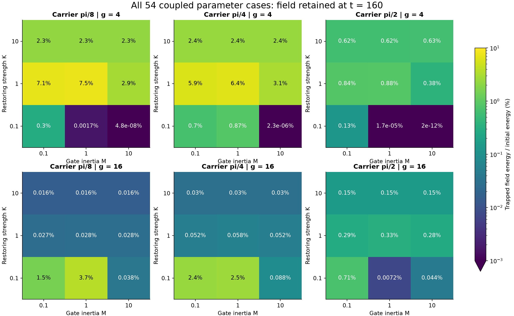
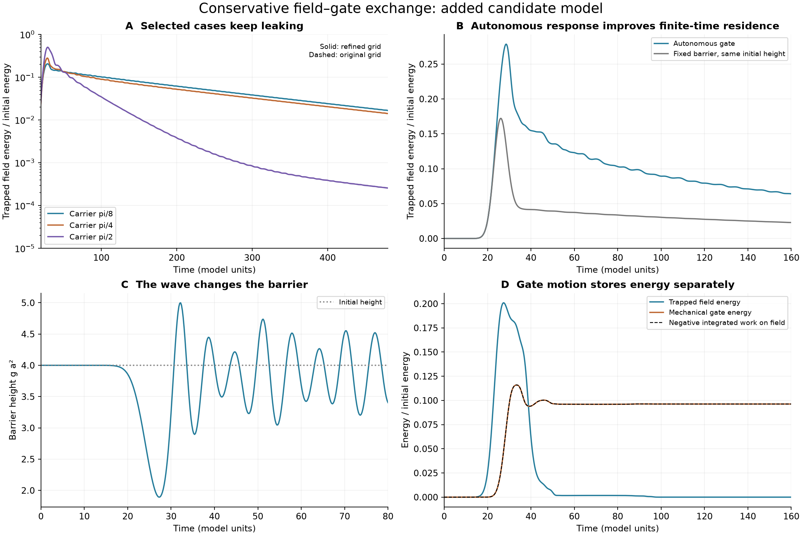

# Autonomous gate: energy exchange works; stationary binding remains excluded

2026-09-23. **A wave can drive its own gate and improve finite-time residence
without external gate work in this candidate model. That does not establish
permanent confinement.** The three cases selected for their field retention at
t=160 continued leaking in longer, independently refined runs. More strongly,
the equations exclude a stationary gate with a nonzero localized harmonic field
for every positive choice of the three model parameters.

Completed: **76 registered runs, four targeted refinement runs, 24 numerical
checks and four symbolic identities**, all passing. Three additional short
trajectories support the independent-solver and time-reversal calibration.
This is a classical 1-D computational experiment with specified inputs. It is
not a full Klein-foam simulation or an empirical discovery of particle mass.

## What was added, and where the energy comes from

The source sections do not select an autonomous throat Hamiltonian. The
[previous experiment](../capture_stability/README.md) supplied a timed barrier
and measured its external work. Here we replace that schedule with an explicit
candidate interaction:

\[
E=\frac12\int\left(|\Phi_t|^2+|\Phi_x|^2+ga^2B|\Phi|^2\right)dx
 +\frac12M\dot a^2+\frac12K(a-1)^2,
\]

\[
\Phi_{tt}=\Phi_{xx}-ga^2B\Phi,\qquad
M\ddot a=-K(a-1)-ga\int B|\Phi|^2dx.
\]

B marks the barrier [4,5]; the cavity is [0,4] with a fixed left boundary.
The gate's real coordinate a starts at1 with zero velocity and zero mechanical
energy. It is a coupling coordinate, not a literal aperture radius. Incoming
field intensity pushes a downward; the restoring force can return it. The
barrier height ga² remains nonnegative even if a crosses zero.

The field does work on the gate and receives work back, with exactly opposite
continuum rates. No external forcing, scheduled trigger, damping or later
normalization is applied. Total energy includes the gate's kinetic and restoring
energy. All quantities are dimensionless, with c=1. The model inputs g,M,K and
the gate's very existence are supplied assumptions; they are not derived from ACS.

The [model derivation](model.md) gives the energy law, equilibrium obstruction
and scope of the transfer from field/mechanical backreaction. In particular,
reciprocal interaction is established machinery in
[cavity optomechanics](https://arxiv.org/abs/1303.0733); that connection motivates
the accounting method and does not validate the physical Klein-foam interpretation.

## Broader parameter test

The initial pulse has envelope width4 and center30. At equal initial energy1,
we tested carriers pi/8, pi/4 and pi/2, two couplings g=4,16, three gate inertias
M=0.1,1,10 and three restoring strengths K=0.1,1,10: **54 coupled cases**.
Each carrier also has an open control and static barriers at both heights.
Additional runs vary input energy, global phase, domain and numerical resolution,
and include a zero-field equilibrium control.

The full grid shows that autonomy can improve or worsen field retention. It is
not enough to say “the gate moves.” Its response time, restoring strength and
the incoming spectrum matter.



Within each carrier's 18 coupled cases, the largest field retention at t=160
occurred at g=4,M=1,K=1. Original-grid results, followed by grid refinement:

- Carrier pi/8: **7.514% → 7.491%**, compared with2.118% for the fixed barrier.
- Carrier pi/4: **6.411% → 6.386%**, compared with2.290% for the fixed barrier.
- Carrier pi/2: **0.8825% → 0.8771%**, compared with0.5985% for the fixed barrier.

These are percentages of initial field energy, with no external work added.
They are maxima over the registered finite grid, not globally optimal policies
or evidence that the same settings are best at every time. The choice of cases
for refinement and extension was registered before observing the sweep.

## Longer observation changes the conclusion about persistence

On the refined grid at t=480, these three selected cases retain respectively
**1.660%, 1.410% and0.02551%**. The final40-time-unit averages are1.828%,1.548%
and0.02812%; the decline is not an artifact of choosing a single unfavorable
oscillation phase. Domain length grows from240 to560 for the longer runs.
The late retained energies change by0.43%,0.52% and1.30% between the two grids,
relative to each original late value.



Panel B compares the middle-carrier autonomous gate with its matching fixed
barrier. Panel C shows its barrier soften and recover without a closure clock.
Panel D uses a different, deliberately gate-dominated case to show why the two
kinds of stored energy must be measured separately.

These extensions test cases selected at160; they do not rank every parameter
combination at480. Nor does continued leakage over this interval prove that all
possible time-dependent joint field/gate states eventually disperse. That broader
claim is not made.

## Mechanical storage can masquerade as field capture

For carrier pi/4, g=4,M=10,K=0.1, **9.628%** of the initial energy remains in
mechanical gate motion at160, while only2.30e-8 of the initial energy remains
as field energy in the cavity plus barrier. Approximately90.37% is field energy
elsewhere in the domain. Counting the gate's mechanical energy as captured field
energy would misidentify the result. It is energy in an explicitly supplied
oscillator, not a newly derived matter degree of freedom.

Input amplitude also matters. At g=16,M=1,K=1, retained field fractions at160
are0.0324%,0.0577% and5.864% for input energies0.25,1 and4. This nonlinear
response follows from the reciprocal coupling. It does not establish a universal
threshold or a unique residual mass; only these three amplitudes were measured.

The earlier externally timed gate's83.2% figure belongs to a different control
protocol with measured external energy input. It is not directly interchangeable
with the autonomous results here.

## An exact result closes the stationary-binding question for this model

For a constant gate a_star and a harmonic field Phi=u(x)exp(-i omega t), define
I=integral B|u|²dx. The gate equilibrium is

\[
a_* = K/(K+gI).
\]

The field then sees a finite compact nonnegative barrier, with a massless open
exterior. At positive squared frequency its exterior solution is oscillatory,
so it cannot be square-integrable unless it vanishes. At zero squared frequency
it is affine and the same conclusion follows; nonnegativity excludes negative
eigenvalues. ODE uniqueness forces the field to vanish throughout.

Therefore **this candidate has no stationary-gate, nonzero localized harmonic
field for any g,M,K>0**. This conclusion is analytic, not a finite search over
parameter values or an extrapolation to infinite time. It leaves genuinely
time-dependent joint localized solutions outside its scope.

Eliminating the gate in equilibrium yields

\[
V_{\rm eff}(I)=\frac{KgI}{2(K+gI)},\qquad
V_{\rm eff}'(I)=\frac g2\left(\frac K{K+gI}\right)^2>0.
\]

The interaction softens the barrier, but does not create the exterior propagation
threshold used in the preceding positive bound-state control. SymPy verifies
the equilibrium, effective potential, derivative and strict minimum identities.
The full exclusion and its assumptions are in [model.md](model.md).

## Numerical evidence and limits

The original15 checks passed without a protocol change or failed run:

- Maximum total-energy drift:3.11e-5 of initial energy. This is measured error;
  the velocity-Verlet integrator is not claimed to conserve physical energy exactly.
- Field/work, gate/work and trap flux/work residuals: at most5.86e-5.
- Independent DOP853 state error drops from0.0006024 to0.0001506 when the time
  step halves. Work disagreement likewise drops1.176e-4 to2.941e-5.
- Reversing both field and gate velocities recovers the initial state to8.48e-14
  in the stated comparison norm. This checks reversible dynamics, not attraction.
- Phase and larger-domain controls change observables by less than1.6e-15.
- The fixed-barrier history agrees with the prior independent midpoint solver
  to6.16e-6. Vacuum remains exactly at its zero-energy equilibrium.

The most sensitive designated case, g=16,M=0.1,K=0.1 at the middle carrier,
had a2.742-unit change in barrier height trajectory between the first two grids.
That justified the separately registered [targeted refinement](refinement-protocol.md).
A third resolution reduces the next height difference to0.933 and the next
trapped-energy curve difference from0.01753 to0.00516 of initial energy.
Its final retained fractions are2.413%,2.655%,2.735% across the three grids.
The trend converges, but detailed fast-gate trajectories are less precise than
the selected g=4 cases and should not be treated as exact predictions.

The other three supplemental runs refine the long trajectories discussed above.
All nine supplemental checks pass; their maximum energy drift is1.35e-6 and
maximum energy/work/flux residual is2.82e-6. The original remote-zone bound is
9.41e-9, including short solver calibration runs; supplemental remote-zone energy
is below1.22e-50. These are finite-domain checks, not a replacement for the
analytic half-line argument.

## Consequence for finishing ACS

The external-work gap is closed **within this added conservative model**: all
stored energy can be traced to the incoming field and reciprocal exchange with
the gate. The candidate supplies autonomous response and finite-time residence.

The stationary-binding question is also settled for this candidate, negatively.
Further parameter tuning of the same equations cannot produce the excluded
stationary localized harmonic state. The next physical completion must explicitly
justify a changed premise—such as the exterior spectrum, the operator or boundary
structure, or a genuinely time-dependent binding mechanism—and retain this energy
accounting. The present work does not select that completion or derive quantum mass.

This records both the demonstrated mechanism and its mathematical limitation.
No result has been promoted into the source manuscripts or standing rules.

## Reproduction and artifacts

From the repository root, use the scientific Python environment at
`/private/tmp/acs-threshold-20260920-venv/bin/python`:

```text
python code/condensate_energy/autonomous_gate.py
python code/condensate_energy/autonomous_refinement.py
python code/condensate_energy/summarize_autonomous_gate.py
```

[Original protocol](protocol.md), [raw trajectories](results.json),
[targeted trajectories](refinement-results.json), [numerical checks](checks.json),
[symbolic checks](symbolic-checks.json), [compact assessment](assessment.json),
and [artifact hashes](receipt.json). The original attempt includes source and
protocol snapshots. The final summarizer verifies both earlier experiments'
frozen hashes before producing the assessment.
