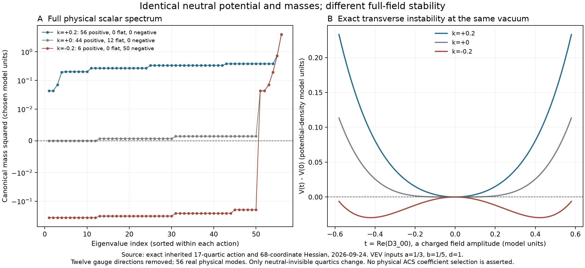

# Canonical vacuum audit: the neutral calculation can miss an instability

2026-09-24. **We now have a complete scalar-mass calculation for the inherited
68-real-field action, and an exact example of why its neutral restriction
cannot establish vacuum stability.** The same neutral potential, vacuum,
quadratic coefficients and four neutral physical masses can coexist with
56 positive physical scalar mass-squared modes, twelve flat physical modes,
or fifty unstable physical directions. The difference lies in quartics the
neutral calculation cannot see.

These are controlled witness actions with chosen dimensionless coefficients,
not a derivation of the physical ACS vacuum or observed particle masses.
They establish what the completed action must decide. This work continues
the [previous binding investigation](../investigation-conclusion.md).



## The completed calculation

The action contains complex Phi(1,2,2) and Delta(bar10,1,3), represented as
a complex2×2 matrix and three symmetric complex4×4 matrices. We rebuilt the
archived **17 real quartics and four quadratic invariants**, differentiated
them in all68 real coordinates, and computed the physical scalar spectrum.
No scalar fluctuation was removed merely because its background value is zero.

For raw complex entries x+iy, the trace kinetic terms give the metric

\[
G=\mathrm{diag}(2\text{ on Phi and diagonal Delta entries},
                 4\text{ on off-diagonal Delta entries}).
\]

Masses therefore solve \(H v=m^2Gv\), or use
\(H_c=G^{-1/2}HG^{-1/2}\). A raw coordinate Hessian is not a physical
mass matrix. We independently checked the generalized eigenvalues under a
nonuniform rescaling of all coordinates, using the
[SciPy generalized symmetric eigensolver](https://docs.scipy.org/doc/scipy/reference/generated/scipy.linalg.eigh.html).
The spectra agree to at most2.3e-16 on the registered relative scale.

At each stationary witness, the21 gauge generators produce12 independent
Goldstone directions. Projecting them out leaves **56 physical real scalar
directions**. The full Hessian obeys the gauge Ward identity to better than
6.5e-17 on the normalized test. Electromagnetic charge commutes with the
mass matrix, and the physical spectrum is resolved into absolute-charge
sectors0,1/3,2/3,1,4/3,2. They have respectively4,18,12,2,18,2 real modes.
Counts refer to real field directions, not distinct particle species.

The background is

\[
\Phi=\mathrm{diag}(a,b e^{i\alpha}),\qquad
(D_1,D_2,D_3)=(1,-i,0)\frac{dE_{44}}{\sqrt2}.
\]

Its unbroken gauge group is the conventional SU(3)c×U(1)em in this
representation. The earlier [gauge mass-Gram calculation](../gauge_completion/README.md)
independently uses the same unequal-Phi neutral-Delta background. The
witness chooses a=1/3,b=1/5,d=1,alpha=0. It does not reproduce the actual
electroweak/high-scale hierarchy or select its units.

## Six quartics are invisible on the entire neutral slice

Put u=b cos(alpha), w=b sin(alpha), N=a²+u²+w² and D=d². The restriction
of all17 quartics has rank11. In the archived basis, the invisible terms are

- the Delta projected norms (35,spin0), (20,spin0), (20,spin2), (45,spin1);
- Re HDelta and Im HDelta, the allowed holomorphic quartic.

The only surviving pure-Delta projected norm is (35,spin2), equal to d⁴.
Four mixed terms survive: ND, auD, awD and -(a²-u²-w²)D/2. All six Phi
quartics survive when the relative phase is retained. The exact full
restriction and basis ordering are in `qualified-results.json`.

The four invisible norm terms still change transverse second derivatives.
HDelta is even less visible at this rank-one color background: its value,
gradient and full Hessian vanish, but its cubic vertices do not. For the
explicit perturbation

\[
D_1=\mathrm{diag}(A,B,C,d/\sqrt2),\quad
D_2=\mathrm{diag}(0,0,0,-id/\sqrt2),\quad D_3=0,
\]

\[
H_\Delta=3ABCd/\sqrt2.
\]

Thus even a complete tree-level mass spectrum cannot identify the two
holomorphic interaction coefficients. Their effects are not removed by
evaluating them on the vacuum. This is consistent with the earlier
[charge audit](../charge_audit/README.md).

## A bounded potential with either a minimum or a saddle

Let I0,...,I16 denote the archived quartic basis, starting at zero. The
controlled family is

\[
V_4=N_\Phi^2+|\det\Phi|^2+N_\Delta^2
+k(I_6+I_8+I_9+I_{10})
+\frac{\mathrm{Re}H_\Delta}{100}
+\frac{\mathrm{Im}H_\Delta}{50}
+\frac{N_\Phi N_\Delta}{10}
+\frac{J_\Phi\cdot J_\Delta}{50}.
\]

All three k values share the quadratic part

\[
V_2=-\frac{2743}{7200}N_\Phi
-\frac{41}{240}\mathrm{Re}\det\Phi
-\frac{1259}{625}N_\Delta.
\]

These coefficients are solved to support the **chosen** background; they
are not presented as predictions. Crucially they do not change when k changes.

At **k=+1/5**, all56 physical scalar mass-squared values are positive,
with minimum **.04321111**. This is a strict tree-level local minimum modulo
gauge directions. It is not a proof of the global minimum or quantum stability.
At **k=0**,44 are positive and12 are flat. At **k=-1/5**,6 are positive and
**50 are negative**: the same neutral vacuum is a saddle of the full action.

The four neutral physical mass-squared values remain

\[
0.06992729,\quad0.19361111,\quad0.72643714,\quad4.00169112
\]

in all three cases, agreeing within1.8e-15. There is no signal of the
instability in that neutral spectrum.

An exact independent witness avoids relying on rounded eigenvalues.
For the physical color-sextet component Re(D3_00), with electric charge
-1/3 for its complex field and canonical real amplitude sqrt(2)Re(D3_00),

\[
m^2=\frac53k+\frac4{5625}.
\]

It equals **1879/5625** at k=+1/5 and **-1871/5625** at k=-1/5.
An infinitesimal gauge transformation of a background proportional to E44
cannot produce a00 entry, so this is a physical instability, not a Goldstone
or coordinate artifact.

All witness quartics are bounded below. The five projected Delta norms sum
to NDelta². The determinant Frobenius bound and real-Gaussian polarization
give |HDelta|<=3NDelta²/16. Together with |Jphi|<=Nphi/2 and
|JDelta|<=NDelta, the weakest member obeys

\[
V_4\ge N_\Phi^2+
\left(\frac45-\frac{3\sqrt5}{1600}\right)N_\Delta^2
+\frac9{100}N_\Phi N_\Delta.
\]

The Delta coefficient is greater than.7958. The negative Hessian therefore
does not arise from choosing a quartic potential that runs to minus infinity.

## Real vacuum values also require the phase equation

With quadratic coefficients m0,...,m3 multiplying Nphi,Re detPhi,Im detPhi,
NDelta, the otherwise omitted phase equation at alpha=0 is

\[
\left.\frac{\partial V}{\partial\alpha}\right|_0
=ab\left[m_2+2l_3ab+l_5(a^2+b^2)+l_{15}d^2\right].
\]

Adding l15=.03 while keeping m2=0 leaves the real-slice potential unchanged
but produces a phase derivative **.002** at the chosen background. Its
projected Hessian is positive, yet it is **not stationary** and hence is not
a vacuum. Setting m2=-.03 explicitly cancels that tadpole; the resulting
separate witness has56 positive physical modes. No CP symmetry or missing
coefficient was silently assumed.

## What survives the source audit

The exact bracket calculation preserves the source's nontrivial algebra:
for the specified B-L generator and color-democratic antisymmetric generator,
the second-bracket norm squared is32/9, the symmetric third-bracket norm
squared is128/9, and its squared projection is **2/3**, giving256/27.
The symmetric bracket is not a multiple of the original antisymmetric
generator. Several comments in the older exploratory scripts conflate
those matrices; the direct calculation retains both components.

A canonical field redefinition is also exact. In the explicitly stated
one-coordinate convention

\[
L_{\rm kin}=\frac Z2(\partial r)^2,\quad
V=c_2r^2+c_4r^4,\quad\phi=\sqrt Zr,
\qquad\lambda_{\rm canonical}=4c_4/Z^2.
\]

Rescaling both potential and kinetic coefficients consistently leaves this
physical quartic unchanged. What the old projection does not supply is the
complete dynamical matching that determines Z and all canonical interaction
coefficients. The manuscript itself marks that normalization chain as partial.
The calculation therefore preserves the algebraic result without promoting
it into an unprovided physical action.

One further source correction matters operationally. The old printed
Delta covariant derivative uses an adjoint commutator. A symmetric anti-10
instead transforms as Delta -> U* Delta U*^T, with generator action
-T*Delta-Delta T*^T. For T15 and E44 the commutator gives zero, whereas the
correct action gives sqrt(3/2)E44. The new calculator uses the symmetric
representation throughout; the old source files remain unchanged.

Finally, `phase50_vacuum.py` sets target scales, calculates quadratic masses
from them, then solves the inverse two-variable system. Exact algebra gives
back the original targets identically. This is a valid conditional radial
construction, already labelled as calibration in that script. It is neither
a scale prediction nor a test of all68 fluctuation directions.

## Evidence, reproduction and current boundary

**33 checks pass**:27 in the qualified audit and six additional exact checks.
The sparse polynomial values agree with the independent tensor-projector
route to3.0e-16 at eight seeded generic fields. Directional gradient/Hessian
checks agree with finite differences to4.5e-8 or better. Stationary full
tadpoles are below5.3e-16. Physical masses survive the coordinate-rescaling
check, and charged sectors commute with the Hessian.

One original verification check failed and is preserved. It compared a
coordinate submatrix containing a charged Delta fluctuation instead of the
declared neutral slice. The correction uses the neutral tangent pullback
T^T H T and independently matches it to the exact restricted Hessian.
No potential, spectrum or tolerance was changed. See
[the amendment](numerical-amendment.md).

Run from the repository root:

```sh
OPENBLAS_NUM_THREADS=1 OMP_NUM_THREADS=1 python code/condensate_energy/canonical_vacuum_audit.py
OPENBLAS_NUM_THREADS=1 OMP_NUM_THREADS=1 python code/condensate_energy/canonical_vacuum_qualify.py
OPENBLAS_NUM_THREADS=1 OMP_NUM_THREADS=1 python code/condensate_energy/canonical_exact_witness.py
python code/condensate_energy/summarize_canonical_vacuum.py
```

The primary script deliberately retains the original failed verification;
qualification is in `qualified-results.json`. The full source basis is in the
earlier content-hashed archive snapshots. `canonical_scalar_action.py` provides
the reusable full-action derivative, metric, gauge-orbit and spectrum routines.
`receipt.json` records the new artifacts and verifies prior evidence unchanged.

The remaining ACS task has narrowed: supply the source-derived coefficients,
especially the four neutral-invisible angular quartics and the two interaction
coefficients invisible even to the mass Hessian, with the complete canonical
matching. The new calculator can then test the resulting vacuum instead of
assuming that a neutral fit settles it. Realistic scale separation may require
multiprecision; the numerical qualification here is for the stated,
well-conditioned witnesses. No observed particle spectrum, nonlinear vacuum
lifetime, quantum effective potential or full threshold matching is claimed.
