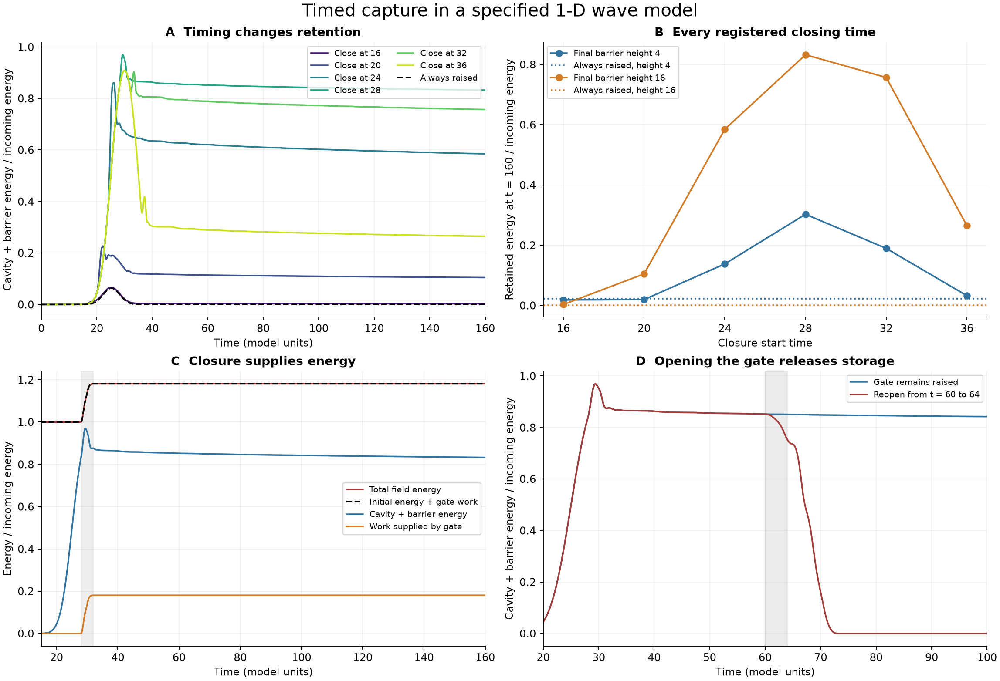
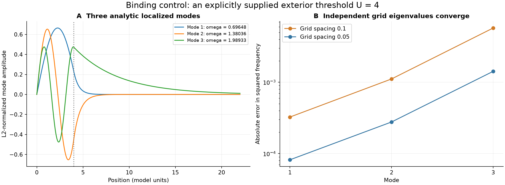

# Capture, gate work and genuine binding

2026-09-23. **Timed closure can retain much more of an incoming wave than a
permanently raised barrier. Closing the barrier also supplies energy. Neither
effect establishes permanent binding or derives matter.** An analytic argument
now excludes stationary bound modes for the previous compact positive barrier;
a separate, explicitly changed model provides a positive binding control.

This continues the [parent condensate-energy experiment](../README.md). It uses
the same classical complex wave model, with one added control: a prescribed
barrier height that changes in time. It does not implement the full nonlinear
Klein foam, Möbius gluing, autonomous phase slips, or a quantum field theory.
All units are dimensionless, with c=1. The source manuscripts and frozen parent
experiment are unchanged; their recorded hashes were verified.

## What the 23 dynamic variants found

An incoming Gaussian pulse has initial energy E0=1, center30, envelope sigma4
and carrier pi/4. The cavity is [0,4]; the unit-width barrier occupies [4,5].
The gate rises smoothly over four time units. Twelve timing cases cover starts
16,20,24,28,32,36 for final heights4 and16; static, reopening, resolution,
boundary, phase and ramp-duration controls complete the 23 variants. These are
variants of one pulse family, not a survey of all incoming spectra or foam states.

For final height16 and closure starting at28:

- At t80, cavity plus barrier contains **0.84640 E0**.
- At t160, it contains **0.83234 E0**, including 0.75179 in the cavity core.
- Closing the gate supplies **0.18081 E0**. Total field energy is 1.18081 E0.
  Thus the retained amount is about70.49% of the final total field energy;
  “83.2%” refers to the initial incoming energy scale, not a passive efficiency.
- Refining space and time gives **0.83263 E0** retained at160, with
  **0.17904 E0** supplied by the gate.
- With the same height16 barrier raised from the start, only **0.00028303 E0**
  remains at160. Most incoming energy is reflected.

Every registered timing remains in the raw data and figure. At height16, retained
energies at160 for starts16,20,24,28,32,36 are respectively
0.00310, 0.10464, 0.58497, 0.83234, 0.75695 and 0.26492 E0.
There is no monotone “earlier is better” or “later is better” law. Start28 is
the largest among these six fixed-duration samples, not a globally optimized
controller. The prespecified duration8 variant retains0.84160 E0 and supplies
0.15786 E0; duration2 retains0.81547 and supplies0.26801 E0. Extra supplied work
alone does not order the retained energies.

At height4, closure at28 retains0.48753 E0 at80 and0.30269 at160; the static
height4 control retains0.02290 at160. This case visibly continues to leak.
The height16 plateau also slowly decreases, from0.84640 to0.83234 E0 over the
same interval. Finite duration cannot certify eternal stability.



The reversible intervention is decisive about the role of the imposed gate:
reopening from60 to64 leaves only3.18e-11 E0 in the region at80 and6.34e-13 at160.
Reopening extracts0.07968 E0, so signed net work over closing and reopening is
0.10113 E0. The remaining energy travels into the exterior. The tiny late
discrete residual is not interpreted as mass or as a continuum bound state.

## Energy provenance is part of the mechanism

For the explicitly time-dependent completion,

\[
\Phi_{tt}=\Phi_{xx}-U(x,t)\Phi,\quad
e=\tfrac12(|\Phi_t|^2+|\Phi_x|^2+U|\Phi|^2),\quad
J=-\operatorname{Re}(\overline{\Phi_t}\Phi_x),
\]

direct differentiation gives

\[
e_t+J_x=\tfrac12 U_t|\Phi|^2.
\]

The right-hand side is work done by the prescribed potential. It must not be
silently counted as incoming energy, energy created by topology, or generated
particle mass. The narrower trap budget for the central case at160 is

\[
E_{\rm trap}-E_{\rm trap}(0)
=W_{\rm trap}-\int J(5,t)dt
=0.17136173-(-0.66098208)=0.83234381.
\]

This identifies work and net boundary transport. It does not assign separate
additive labels to interfering field components or justify subtracting all gate
work from the trapped energy and calling the difference a measured capture
efficiency.

For numerical evolution, implicit midpoint uses the average endpoint
Hamiltonian. Its exact discrete work is

\[
\Delta W=\frac{\Delta x}{4}\sum_j
(U_j^{n+1}-U_j^n)(|q_j^{n+1}|^2+|q_j^n|^2).
\]

This follows by conserving the quadratic Hamiltonian with the fixed midpoint
potential over each step, then accounting for both endpoint potential changes.
We separately integrated the continuum expression with DOP853 and with midpoint
quadrature. Agreement under refinement checks the work formula against an
independent time integrator, beyond merely testing its exact discrete identity.

Barrier insertion and its energy transfer are also studied in the distinct
Schrödinger model of [Baek, Yi and Kim (2016)](https://arxiv.org/abs/1611.07129).
That is background for the importance of accounting for barrier work; its
results are not substituted for this classical wave calculation.

## Why the earlier finite barrier cannot bind a stationary mode

This is an analytic result about the specified continuum operator. Let

\[
H=-\frac{d^2}{dx^2}+U(x),\quad x\ge0,\quad u(0)=0,
\]

where U is real, bounded, nonnegative and zero outside a finite interval.
A bound normal mode would require a nonzero square-integrable eigenfunction
Hu=lambda u. For this self-adjoint operator, lambda is real.

1. Negative lambda is excluded by
   \(\langle u,Hu\rangle=\int(|u'|^2+U|u|^2)dx\ge0\).
2. For positive lambda, the exterior solution is a linear combination of sine
   and cosine. It is square-integrable on a half-line only when both coefficients
   vanish. ODE uniqueness then forces the entire solution to vanish.
3. For lambda=0, the exterior solution is affine. Square integrability again
   forces both coefficients to vanish, and uniqueness gives the zero solution.

Therefore this operator has **no nonzero L2 bound eigenmode**. A finite barrier
can still produce resonances and very long residence times. Raising the gate
to another finite height returns the system to the same assumptions after
closure; its long retention is not evidence of a stationary bound mode.

This argument neither requires counting modes to infinity nor applies to every
possible foam, topology, nonlinear action or exterior medium. A finite
Dirichlet simulation box has its own discrete modes; those must not be confused
with half-line bound states. A finite-difference lattice also has an artificial
upper spectral edge, so numerical localization alone cannot replace this
continuum argument.

## Positive control: change the exterior spectrum explicitly

Set U=0 on [0,4] and U=mu²=4 throughout the exterior. This is a different model:
the exterior now has a nonzero propagation threshold. Modes with0<omega<mu
can decay outside rather than radiate. Matching field and derivative at4 gives

\[
u(x)=\begin{cases}
A\sin(\omega x),&0\le x\le4,\\
A\sin(4\omega)e^{-\kappa(x-4)},&x>4,
\end{cases}\qquad
\kappa=\sqrt{4-\omega^2},\quad
\omega\cot(4\omega)=-\kappa.
\]

There is one root in each of the three negative-cotangent branches below mu=2
and none in the positive-cotangent branches. The roots are
**0.69647553, 1.38036161, 1.98933037**. Their exterior decay rates are
1.87481248, 1.44727393 and0.20631206. These are genuine localized oscillatory
modes of this supplied linear model. Independent finite-difference eigenvalues
converge to their analytic squared frequencies.



The exterior threshold is an **input**, not an emergent result. Its dimensionful
scale has not been obtained from ACS, and the classical mode amplitude remains
free: rescaling it changes energy continuously. These modes do not predict a
unique particle rest mass. Moreover, a time-independent linear Hamiltonian does
not transfer a continuum scattering state into its bound spectral subspace.
Existence of bound states and a mechanism that populates them are separate tasks.

## Verification, including the failed check

The initial run completed all23 long dynamic variants and two short calibration
runs. Twelve of its13 grouped checks passed. The exception was the spectral
control's domain20 versus40 comparison: the most weakly bound mode has decay
length about4.85, and the resulting eigenvalue shift1.161e-4 exceeded the
registered1e-5 tolerance.

The failure and original source/protocol are preserved under
`attempts/20260923T173312563494Z/`. The separately registered
[domain amendment](domain-amendment.md) compares domains40 and60 without relaxing
the threshold. All three supplemental checks pass; the largest domain shift is
2.617e-8. No dynamic case or outcome was changed. The final
[assessment](assessment.json) explicitly records the original failure and the
successful replacement, instead of labeling the original run all-pass.

Other checks:

- Global energy/work residual <=5.71e-12 E0; regional flux/work residuals
  <=3.59e-12 E0, over sampled trajectories including calibration runs.
- Independent ODE state error drops0.002644 to0.000662 in the final energy norm.
  Independently integrated work disagreement drops2.46e-6 to6.01e-7 E0.
- Space/time refinement changes the full trapped-energy curves by at most
  0.006365 and0.002508 E0 for the two designated closure cases.
- Enlarging the dynamic domain leaves the designated curve unchanged at the
  reported precision. Global phase changes observables by <=5.33e-15 E0.
- The maximum sampled energy in the distant boundary zone is1.38e-10 E0,
  including the shorter ODE calibration domain.
- The bound-mode matching residual is2.73e-14; fine-grid squared-frequency error
  is0.001424, down from0.005765 on the coarse grid.

These checks validate the stated numerical measurements. They do not turn the
toy model into empirical evidence for the proposed physical ontology.

## What this closes for ACS, and what remains

The audit now distinguishes four claims: temporary residence behind a static
barrier; controlled loading by a changing barrier; existence of genuine bound
modes; and autonomous formation of a localized state. The first three have
explicit, different tests here. The fourth is still missing from this completion.
In particular, a single transmission factor cannot stand in for all four.

An autonomous gate must respond to the field and carry its own energy. For
example, if an eventual ACS action supplies a gate coordinate a, inertia M,
potential V(a), and coupling U(x,a), the conservative equations must include

\[
M\ddot a+V'(a)=-\tfrac12\int\partial_a U\,|\Phi|^2dx,
\quad E_{\rm total}=E_{\rm field}+\tfrac12 M\dot a^2+V(a).
\]

The two energy exchanges then cancel. This is a consistency condition for such
an action, not a selection of M, V, a topology, or a physical mass spectrum.
Those inputs must come from a specified source model; choosing them after seeing
the desired capture would leave the main explanatory gap intact. A damping or
radiation channel likewise needs an explicit destination for its energy.

The practical result is a reusable capture test with energy provenance and a
bound-state discriminator. The remaining physics is narrowly identified:
derive the autonomous coupling and binding mechanism, then test whether they
produce and preserve localized states without an externally scheduled gate or
an unexplained exterior threshold.

## Reproduce and inspect

Use `/private/tmp/acs-threshold-20260920-venv/bin/python` from the repository root:

```text
python code/condensate_energy/capture_stability.py
python code/condensate_energy/bound_domain_check.py
python code/condensate_energy/summarize_capture_stability.py
```

The first command intentionally returns a failing status for the preserved
original domain20 protocol; run the registered supplement next, not as a chained
success-only shell command. The final summarizer accepts only that specific
documented failure, checks the supplemental results and all recorded source
hashes, verifies the frozen parent artifacts, and writes the amended receipt.

Raw histories: the original attempt's `results.json`. Compact outcomes:
[assessment.json](assessment.json). Spectral supplement:
[bound-domain-results.json](bound-domain-results.json). Artifact hashes:
[receipt.json](receipt.json). No findings have been promoted into standing rules
or source manuscripts.
