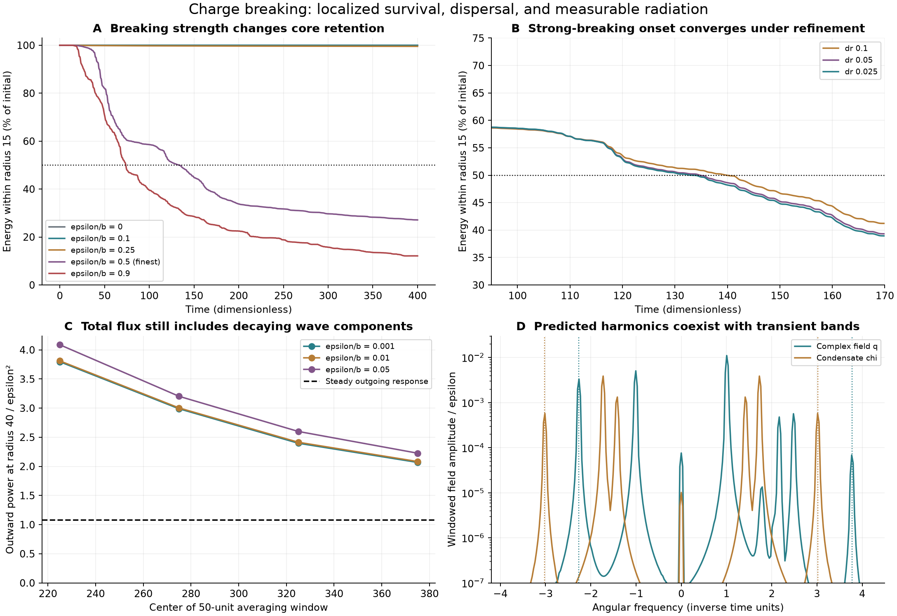

# Charge leakage, dispersal, and the outgoing radiation channel

2026-09-23. **Completed scoped classical experiment; the broader ACS binding
investigation remains active.** Twenty nonlinear evolutions, an exact scalar
field map, and independent outgoing-wave calculations distinguish weak
leakage from strong dispersal. The two initial numerical qualification
failures remain in the record and were addressed without relaxing tolerances.

The main result is a separation of behaviors. Weak breaking does not destroy
the localized state on the measured interval, but does produce radiation.
Stronger breaking causes substantial dispersal. Conservation-law failure,
finite-time residence, and a physical particle lifetime are different claims.



## Interaction and its ACS scalar origin

Add the term

\[
V_{\rm break}=\frac{\epsilon}{4}\operatorname{Re}(q^4)
\]

to the [qualified two-field model](../self_binding/README.md), retaining
\(b=2\sqrt3/27\). Its equations are

\[
q_{tt}=\Delta q-\chi^2q-b|q|^2q-\epsilon\bar q^3,
\qquad
\chi_{tt}=\Delta\chi-\chi(\chi^2-1)-\chi|q|^2.
\]

For the original charge convention, the exact balance is

\[
\dot Q=\epsilon\int\operatorname{Im}(q^4)\,d^3x
\]

when no charge flux crosses the outer boundary. The Hamiltonian remains
time independent. All tested strengths obey \(|\epsilon|<b\), so the
quartic in q remains nonnegative for every phase. The simulations use no
damping, absorber, external gate, or normalization after initialization.

This interaction can be obtained from an explicit gauge-allowed scalar
configuration in the audited Phi/Delta representations:

\[
\Phi=\frac\chi2 I_2,\qquad D_1=D_2=0,\qquad
D_3=\frac{q}{2\sqrt2}I_4.
\]

Then \(N_\Phi=\chi^2/2\), \(N_\Delta=|q|^2/2\), and
\(H_\Delta=3q^4/64\). The gauge-invariant selected potential

\[
(N_\Phi-1/2)^2+2N_\Phi N_\Delta+bN_\Delta^2
+\kappa H_\Delta+\kappa^*H_\Delta^*,\qquad
\kappa=8\epsilon/3
\]

reduces exactly to the tested potential. Both kinetic terms have the required
one-half normalization. All 15 color-generator projections and the weak
current projections vanish on this fixed-orientation ansatz. Its selected
potential preserves the scalar ansatz, so zero gauge fields and zero
classical fermion fields are consistent here. This does not exclude gauge
perturbations or quantum production of fermions.

**This is a selected test action and a different vacuum/orientation from the
failed neutral-Delta identification.** Its exterior has Phi nonzero and
Delta zero; its interior Delta configuration has rank four. The additional
permitted quartics are explicitly set to zero for this experiment. Neither
these exclusions, the coefficients, nor the vacuum have been derived as the
physical ACS choice. The charge audit and its quantum anomaly obstruction
remain valid. A gauge-compatible scalar ansatz alone does not finish the
full-theory identification.

## Twenty evolutions and their measured outcomes

All runs start with the previous unbroken-model stationary profile at charge
1000, with the chosen breaking interaction already present in the initial
Hamiltonian. The initial energy is measured, not fixed to its old value.
Thus these are response experiments for a specified preparation, not solutions
first minimized in the broken theory.

The original batch covers \(\epsilon/b=0,.001,.01,.05,.1,.25,.5,.9\),
additional initial phases \(\pi/8,\pi/4\) at ratio .5, a negative-coupling
equivalence control, charge reversal, vacuum, and two mesh refinements.
Five follow-ups refine the strong case and measure weak outgoing flux directly.

The domain radius is 460 and the final time is 400, in model units. Core
energy means energy inside radius 15 divided by each run's initial energy.
The operational half-energy exit is the first sample followed by at least
10 time units continuously below 50%. This is a residence measurement, not
a universal half-life.

- With no breaking, core retention at time 400 is **99.99990%**.
- At ratios .001, .01, .05 and .1, the coarse-grid retentions are
  **99.99990%, 99.99943%, 99.98765% and 99.94791%**. The .1 refinement gives
  **99.94839%**. None reaches the half-energy exit in the observation window.
- At ratio .25, the coarse run retains **99.54938%** at time 400.
- At ratio .5, the finest run retains **27.12863%** and crosses the sustained
  half-energy condition at **133.2**. The three mesh values are
  **139.9, 134.8, 133.2** for spacings .1, .05 and .025. Quote the onset as
  approximately 133–135 in the two finest runs, not an exact physical lifetime.
- At ratio .9, the exploratory coarse run retains **12.12358%**, with the
  half-energy exit near **73.8**; this individual value has not received the
  strong .5 case's three-grid qualification.

Phase also matters because the breaking term depends on four times the phase.
The .5 runs at phases 0, \(\pi/8\), and \(\pi/4\) start with energies
**880.42, 838.13, and 795.85**, respectively. Their exploratory coarse exit
times are **139.9, 87.1, and 112.6**. They are not equal-energy preparations.
Negative epsilon at phase zero agrees with positive epsilon at phase
\(\pi/4\) to approximately \(5\times10^{-14}\) in the compared normalized
energy/charge observables, as the field redefinition requires. Charge reversal
reverses the charge history and preserves energy exactly in the recorded run.

Strong cases can reverse their net field charge: it is not a monotone
particle-count loss. In the finest .5 case, final total charge is about
**-0.17345 of the initial charge**. Charge sign change and outward energy
must therefore be tracked separately. The vacuum control stays exactly at
vacuum; its zero-energy threshold output is not a lifetime measurement.

## Numerical qualification and preserved failures

The largest relative energy drift in the first batch is
\(5.53\times10^{-6}\), while charge minus its integrated source differs
by at most \(5.64\times10^{-14}\) of initial charge. Energy in the far
boundary zone is below \(2\times10^{-122}\) of initial energy; no boundary
return drives the observed collapse.

The original .5 comparison **failed**: spacings .1 and .05 differ by .02009
of initial energy in the local-energy curve and .04356 of initial charge
in charge history, above the registered .02 tolerance. These outcomes remain
unchanged in `results.json` and the frozen attempt directory.

The new .025 initial stationary profile has gradient norm
\(9.72\times10^{-12}\). Comparing the .05 and .025 evolutions reduces
the maximum energy-curve discrepancy to **.0049245** and charge discrepancy
to **.0107172**, passing the same .02 gates. At fixed spacing .05, halving
the time step changes the energy curve by only **.00003645** and charge by
**.00008311**. Spatial refinement is the relevant correction here. The
follow-up maximum energy/source/flux balance errors also pass all registered
gates. The numerical tolerance does not assert convergence under arbitrary
nonradial or full-field disturbances.

## Independent radiation prediction

For the original rotating background \(q=f(r)e^{i\omega t}\), the breaking
force contains \(-\epsilon f^3e^{-3i\omega t}\). Its coupled linear
response has complex-field channels at **-3 omega and +5 omega**, and real
condensate channels at **plus/minus 4 omega**. At the reference
\(\omega=0.754888212\), these frequencies are above the appropriate
exterior propagation gaps, 1 for q and \(\sqrt2\) for chi.

The outgoing boundary-value calculation predicts, without fitting an emitted
amplitude,

\[
P_{\rm steady}=1.077996267\,\epsilon^2+\text{higher-order terms}.
\]

The leading coefficients by channel are **0.973414129** for the -3 omega
complex wave, **0.001404123** for the +5 omega wave, and **0.103178015** for
the condensate. The average charge source coefficient is **-1.857476109**,
and the outgoing charge-flux coefficient is **-0.429455046**. They satisfy
the independently integrated relation

\[
S=-P/\omega+J_Q
\]

to \(7.88\times10^{-11}\) in the registered normalized residual.

This calculation initially failed its complex solver's mesh/residual gate.
The original results are retained in `radiation-results.json`. Recasting the
same equations into real and imaginary components with an exact Jacobian
reduces the maximum residual below \(10^{-8}\). An independently assembled
finite-difference solve approaches the same power with errors **2.387%,
0.5934%, and 0.1481%** under successive refinement. Extending the continuum
domain from 30 to 40 changes the power by \(4.27\times10^{-10}\) relative.
All five radiation qualification gates pass after this numerical correction.

### Comparison with the actual emitted waves

At ratio .001, direct probe amplitudes at radius 40 over times 200–400 agree
with the predicted three harmonic amplitudes to **3.62%, 1.38%, and 2.95%**.
The comparison projects onto the predicted frequencies with a Hann window;
no frequencies or amplitudes were fitted to improve agreement. The nonlinear
probe uses the coarse spatial mesh, so this is a few-percent confirmation,
not an exact continuum measurement.

The **total** outward power over that interval is larger:
\(P_{\rm total}/\epsilon^2=2.8127\) at ratio .001, versus the steady
prediction 1.0780. Extra wave components, including near-threshold bands,
remain in the preparation response. Their total normalized flux decreases
across the four fixed 50-unit windows from **3.796 to 2.068**. Ratio .01
gives a similar sequence and total coefficient **2.8280**. This is consistent
with decaying preparation transients plus a persistent forced response; it
does not prove the total flux has reached its asymptotic value. Strong .5
dispersal is outside this weak-breaking expansion.

The initial quantity \(E/P\) from the steady prediction is
\(777.5195/\epsilon^2\) in these dimensionless units. It is a local
weak-breaking energy-loss scale, **not a calculated half-life**. The object
changes as it radiates, the preparation carries transient excitations, and
ACS has not fixed epsilon or the physical mass/time scale. No lifetime in
seconds is inferred.

## What this closes, and what remains in the active investigation

The classical leakage branch now has an explicit interaction, exact charge
balance, a gauge-allowed scalar realization, convergent examples of dispersal,
and an independent radiation channel visible in the evolution. Simply
asserting that an approximately conserved charge must either bind forever or
disappear immediately is ruled out by these results.

The outstanding ACS questions require the complete physical assignments:
an existing gauge charge rather than an anomalous global charge; its Gauss
constraint and gauge-field energy; scalar directions omitted by this ansatz;
fermionic charge carriers and their thresholds; and the source-selected
couplings, vacuum and normalization. The present field map is useful as a
controlled test, but cannot replace those derivations. These remain part of
the active goal.

Charge-breaking instability and gauged solitons are established research
directions; their known existence does not establish this ACS identification.
For relevant primary examples see
[Kawasaki, Konya and Takahashi on U(1)-breaking instability](https://arxiv.org/abs/hep-ph/0504105)
and [Loiko and Shnir on gauged FLS solitons](https://arxiv.org/abs/1906.01943).
Our equations, numerical values and qualifications above are specific to the
recorded selected model.

## Reproduction and files

Run separately from the repository root with NumPy, SciPy, SymPy and Matplotlib:

```sh
OPENBLAS_NUM_THREADS=1 OMP_NUM_THREADS=1 python code/condensate_energy/charge_leakage.py
OPENBLAS_NUM_THREADS=1 OMP_NUM_THREADS=1 python code/condensate_energy/charge_leakage_refine.py
OPENBLAS_NUM_THREADS=1 OMP_NUM_THREADS=1 python code/condensate_energy/charge_radiation.py
OPENBLAS_NUM_THREADS=1 OMP_NUM_THREADS=1 python code/condensate_energy/charge_radiation_refine.py
python code/condensate_energy/summarize_charge_leakage.py
```

The two original scripts may return nonzero for the preserved numerical
failures; run the documented refinements afterward, not through an `&&` chain.
The protocols precede their runs. The original nonlinear source and data
snapshot lives under `attempts/20260924T013527303056Z/`. `assessment.json`
contains compact conclusions, `refinement-results.json` the targeted data,
and `radiation-qualified.json` the repaired response. `receipt.json` records
hashes of the report, scripts, protocols and data. Earlier self-binding and
charge-audit artifacts remain unchanged.
