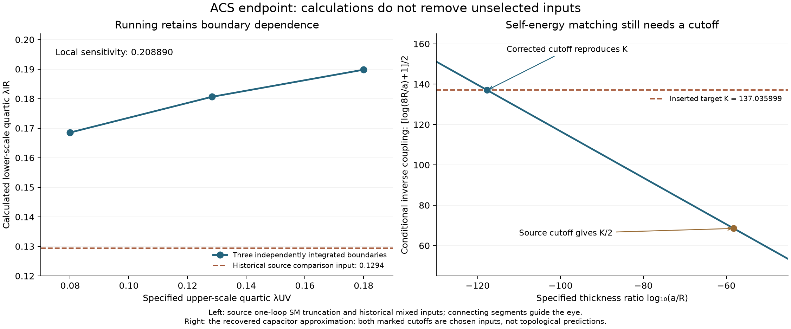

# ACS action-to-carrier investigation: endpoint assessment

24 September 2026. **The reviewed ACS assumptions define calculable families
of models, but do not select a unique physical particle, mass scale or flavor
spectrum.** This is demonstrated by explicit compatible countermodels,
normalization identities and a continuous family of complete actions. It is
stronger than failing to find a file, and narrower than saying that no future
ACS completion is possible.

The investigation has reached the evidence boundary of the supplied action
and recovered selection proposals. Its useful product is a verified forward
calculation: specify the normalized action and boundary data, then calculate
the vacuum, spectra, thresholds, binding and leakage within the stated
approximations. It is not a completed theory of matter or a proof of RH.

This final stage records **95 passing checks and one incomplete source
replay**. The incomplete replay hit a 60-second symbolic-solver limit; its
printed real equations were subsequently solved by an independent exact
elimination. The preceding [source endpoint](../source_endpoint/README.md)
adds 52 passing checks. Counts describe checks, not independent experiments
or proof of every statement printed by an archived program.

## What survives and can be used

The [complete scalar calculator](../canonical_vacuum/README.md) retains
68 real scalar coordinates, 17 real quartic coefficients, four quadratic
coefficients and the kinetic metric. Six quartic directions are invisible to
the restricted neutral potential but change physical stability. The
[radiative audit](../hidden_couplings/README.md) restores the relevant
couplings; the old reduced potential is generally not closed under running.

The action now has [explicit complete first-stage spectra and tree matching](../action_matching/README.md),
[radiative tests of flat directions](../radiative_flat_modes/README.md), and
[finite one-loop matching on a specified stable branch](../finite_matching/README.md).
The latter includes mixed heavy/light effects, light-field subtraction,
finite kinetic normalization and independent 80-digit limits. It assumes a
particular light doublet, portal structure and real diagonal flavor. General
mixed-quartic, noncommuting-flavor finite EFT matching is not claimed.

The [reduced classical model binds](../self_binding/README.md) for specified
parameters. Restoring [charge breaking](../charge_leakage/README.md) gives
measurable leakage and independently predicted radiation. Including an
[existing gauge charge and its electric energy](../gauge_completion/README.md)
preserves some conditional bound configurations. These results are useful
mechanism tests. They do not identify an elementary particle or certify its
full-theory lifetime.

## The scale ambiguity holds for the complete action

Write the flat-space scalar potential as

    V(x) = Ω + Σ mᵢ I₂ᵢ(x) + Σ λⱼ I₄ⱼ(x),

where mᵢ denotes a mass-squared coefficient. Every I₂ is homogeneous of degree
two and every I₄ of degree four. For any positive a, transform the dimensional
data together:

    x → a x,   mᵢ → a² mᵢ,   Ω → a⁴ Ω,   μ → a μ.

Keep the dimensionless quartics, gauge couplings and Yukawa matrices fixed.
Then V→a⁴V, its gradient→a³∇V, and the canonical scalar Hessian→a²H.
The complete gauge mass Gram scales by a². The Weyl mass matrix scales by a,
including arbitrary complex noncommuting Y,Z and complex symmetric F.
Consequently the physical masses change while mass ratios, charge labels and
stability signs remain the same.

This is a family of physically different actions, **not** a coordinate
symmetry of one action with fixed dimensional inputs. The polynomial proof
covers all 17 quartics and four quadratics; two numerical rescalings check all
68 fields, the 21-vector Gram and a 48-Weyl complex-flavor example. On a
previously qualified stable neutral vacuum, the complete one-loop potential
also scales by a⁴: every log(M²/μ²) remains unchanged. The calculation does
not choose a preferred a. A fixed measured Newton constant or other physical
scale could be an additional input, but needs a derived matching relation to
the matter sector. That relation is not supplied by this scaling identity.

Ordinary dimensional transmutation likewise needs an integration constant:
Λ=μ exp[−1/(2b g²(μ))]. A beta function without a boundary condition does not
select Λ in physical units. Approximate focusing can reduce sensitivity; it
does not erase all boundary information over a finite regular interval.

## The remaining running and normalization sources

`seven_tests.py` prints several incompatible normalization attempts before
returning to a comparison with an inserted measured Higgs quantity. The
correct radial identity is h=√Z r and λcanonical=4c₄/Z² for the convention
V=c₄r⁴=λcanonical h⁴/4. Consistent coordinate changes preserve this result;
an undetermined common action prefactor remains physically relevant.

The complete `four_computations.py` replay and an independent integration
agree on the consequences of its historical inputs. Setting the upper-scale
quartic to 2√3/27 produces a lower-scale quartic **0.1806315**, not its
comparison input 0.1294. The resulting tree mass proxy is about **148 GeV**;
this is not a pole-mass calculation. Upper quartics 0.08, 0.1283001 and 0.18
give lower values 0.1685520, 0.1806315 and 0.1898121. The independently checked
local sensitivity dλIR/dλUV is **0.2088898**, not zero.

Its QCD crossing g=4/3 occurs at **25.6476 GeV**, conditional on the inserted
MZ and alpha_s(MZ). At that crossing the same diagnostic gives g₂≈0.658857,
so equating one coupling is not simultaneous gauge matching. The script's
square-root mass texture is rank one, leaving degenerate zero-mass subspaces;
its eigensolver mixing is not a nondegenerate CKM prediction. Its strong-CP
argument also fails: [A,A]=0 does not imply Tr(F∧F)=0, and real matrices need
not have positive determinant. The bare theta coefficient remains a separate
action datum; see the [PDG QCD action](https://pdg.lbl.gov/2025/reviews/rpp2025-rev-qcd.pdf).

`phase6_dynamics.py` correctly distinguishes an internal algebra bracket from
spacetime torsion and identifies the need for boundary data. Its full replay
timed out in the symbolic four-quartic solve. We preserved the failed driver
and traceback, then independently exhausted the real branches of those exact
printed equations. With xᵢ=λᵢ/(16/9), the fourth equation is
4x₄(x₁+x₂−3)=0. A nonzero x₄ would make the second equation
2x₃²+2x₄²+3=0, impossible over the reals. The third equation then splits into
x₃=0 or x₃=(3−x₁−x₂)/2. Exact elimination and Sturm root counts give just two
real solutions, both on x₃=x₄=0:

    (λ₁,λ₂) ≈ (0.1811535,0.5106919), (0.6447133,0.5764245).

Neither gives 2√3/27. These are roots of a fixed-gauge four-quartic proxy;
they are not fixed points of the complete running action. The later
[full RG analysis](../../frontier/2026-09-11/workstreams/rg/report.md) already
distinguishes its loop truncations and fixed-point obstructions. Completing
all higher-loop terms would be further conditional theory development, not
a missing evaluation of the printed proxy or a supplied physical selector.

## A recovered claim of complete closure does not close the inputs

The archived Antigravity record contains the full 31,026-character August
**Constraint Projection Framework** article. Two recovered payloads are
byte-identical; their parent record and offsets are retained in
[CPF-recovery.json](CPF-recovery.json). We read the article, including its
appendices, and tested the claimed routes relevant to the missing inputs.

1. **The stated cover map does not descend.** In the source's orientation
   double cover, the deck action on H₁ is D=diag(1,−1). A lifted diffeomorphism
   of the quotient must commute with this nontrivial deck action. Its proposed
   M=[[1,2],[0,1]] instead has MD−DM=[[0,−4],[0,0]]. The map is not the claimed
   quotient diffeomorphism. Its trace 2 cannot fix a framing or a magnetic
   moment. The printed metric does respect the glide pullback, but retains
   independent radius and pitch parameters.
2. **The constant is inserted and the self-energy algebra has a factor error.**
   Its capacitance, split charge and radius give E/(mc²)=αL/2, where
   L=log(8R/a)+1. Setting E=mc² therefore gives α⁻¹=L/2, not L. Inserting
   a/R=8 exp[−(K−1)] makes L=K for any chosen K. The displayed exponent uses
   K=137.035999171. Its actual exponential is 6.65896×10⁻⁵⁹, also different
   from the printed approximation. Matching the same K using its own
   self-energy equation requires 2.03905×10⁻¹¹⁸. Neither value is derived by
   topology. The July relational-electrodynamics source already has the
   factor 1/2 and labels cutoff matching as an input.
3. **The projection kernel needs more data.** A two-dimensional surface
   integrated against a three-dimensional delta function produces a surface
   distribution, not an ordinary volume L² state. A normalized Gaussian of
   thickness ε has squared transverse L² norm 1/(2√π ε), diverging as ε→0.
   A smearing rule, domain, field normalization and physical dynamics are
   needed; calling the kernel an electron does not provide them.
4. **The claimed dark/visible split is not gauge invariant.** Multiplying a
   charged field by i exchanges real and imaginary components while leaving
   |Dψ|² unchanged. The imaginary component does not lose its electromagnetic
   coupling. The asserted cosine/sine overlap is already nonzero for constant
   phase π/4. The displayed rotation formula tends to zero for finite total
   visible mass; its 1/r² quantum contribution does not yield a nonzero flat
   asymptote.
5. **The RH/flatness step contradicts its own formula.** Its printed curvature
   summand is 2ε/[(1/2−β)²−ε²]. At β=1/2 this equals −2/ε, not zero.
   Direct integration of a finite summand instead has a vanishing long-time
   average, for on-line and off-line test locations away from a contour pole.
   This does not justify interchanging an infinite zero sum and a limit.
   No map from this chosen functional to physical FLRW curvature is derived.
   No actual zeta zero is located or excluded by these checks.
6. **The Bell identity survives within its actual assumptions.** The supplied
   Bell state and operators give 2√2. The same operators on a product state
   give √2. The quantum state and observables are inputs; the two-to-three
   coordinate map has rank two. Thus this calculation does not derive quantum
   nonlocality from a new spatial dimension, or by itself select which
   philosophical assumption of an observer theorem must fail.

The manuscript's spin and magnetic-moment identifications also reuse the
framing claims explicitly withdrawn in the current Klein-foam note and
tested in the [physical frontier](../../frontier/2026-09-11/workstreams/physical/report.md).
The two-element spin-cover class does not supply a real-valued gyromagnetic
ratio. We have not authenticated the article's claimed experimental
confirmations; its algebraic failures are sufficient to reject the claimed
zero-input derivation, without making a claim about those experiments.

## What the gravitational and microscopic action actually supplies

The reviewed Palatini passage proposes adding β Tᵃ∧*Tₐ as a kinetic term for
independent torsion. With a smooth nondegenerate tetrad and metric-compatible
independent connection, write ω=ωLC+K. Then

    R(ω)=R(ωLC)+DLC K+K∧K,      T=K∧e.

In the Palatini term, DLC(e∧e)=0 makes the term linear in DLC K a boundary
term. T² and K∧K are algebraic in K. They provide no independent contortion
wave operator. Our component check retains all 24 contortion components.
This agrees with the explicit algebraic quadratic-torsion decomposition in
[Vashistha et al., equations 4–10 and §2.2](https://arxiv.org/html/2606.09786v1).
Additional curvature-derivative terms or a separately specified defect sector
could change that conclusion; their coefficients, boundary conditions and
mode content must be stated. They are not generated by renaming T².

The recovered MacDowell–Mansouri soldering script inserts a Lorentzian eta,
a nondegenerate vierbein and ell=1. The metric eᵀ eta e retains the supplied
signature; its displayed curvature-square expansion retains ell as an input.
The accompanying archive explicitly records that its linear order-parameter
action does not dynamically select a nonzero VEV. This is a conditional
construction, not the missing action-to-parameter derivation.

The separate Seagate `rc7_lagrangian.py` proposes thermal mixing for a two-field
norm portal. That potential and diagonal chemical potentials preserve two
independent phase symmetries. In an unbroken state they forbid an off-diagonal
bilinear mass; a condensate, explicit mixing or another interaction must be
specified to evade that selection rule. No ACS field/parameter identification
is supplied by that toy model. The color-weight script likewise computes
representation weights, not a dynamical scale or coupling normalization.

The recovered `newton_colour_music-1.py` adds a distinct proposed bridge:
it labels (|R⟩+|G⟩+|B⟩)/√3 a color singlet. Exact application of all eight
SU(3) generators disproves that identification. Its two Cartan expectations
vanish, but their summed variance is 1/3 and its quadratic Casimir is 4/3.
The fundamental representation has no nonzero invariant vector. As positive
controls, the usual triplet–antitriplet and antisymmetric three-triplet
states are invariant under all eight generators. A zero mean charge is not
an invariant state. This removes this proposed optical/music analogy as a
particle-identification rule; it does not reject studying spectra across
different physical systems. These nine exact checks are in
[colour-singlet.json](colour-singlet.json).

## Original requirements and their final disposition

- **Recover and inspect the underlying action and selector proposals:** the
  canonical manuscripts, complete invariant basis, relevant source snapshots,
  four-root 36-entry inventory and additional archived normalization/CPF/action
  routes are mapped to evidence. The archive rescreen examines 3,645 distinct
  extracted-text paths and finds 138 matches across four named patterns.
  These are discovery counts, not 138 independently validated models. Neither
  keyword screening nor this audit certifies complete cloud-chat recovery.
- **Derive the action's complete scalar interactions and vacuum implications:**
  complete invariant and kinetic calculations, gauge covariance, hidden
  directions, exact spectra, stationarity and bounded witnesses establish the
  forward problem. Symmetry alone permits different stable local alignments
  and both stable/unstable transverse spectra at the same restricted neutral
  data. A unique physical vacuum is demonstrably underdetermined.
- **Follow matching and normalization to physical predictions:** tree matching
  and the declared finite one-loop branch are verified. The recovered proposed
  coefficient/scale/flavor selectors fail or remain inserted boundary choices.
  The full-action dilation proof survives arbitrary complex flavor. It
  establishes the missing physical scale without needing to finish every
  possible finite-threshold calculation at unselected parameter points.
- **Test binding and identify all relevant carriers:** conditional classical
  binding and leakage are established. Generic global-charge protection is
  broken or anomalous. In the selected gauged exterior there are additional
  massless charged vectors, so a scalar-only threshold cannot certify a
  particle. In the conventional neutral vacuum the proposed neutral component
  is electromagnetically neutral. Charged partners have a computed spectrum,
  but no source-selected masses or condensate map. Explicit allowed Yukawa
  choices give opposite answers for fermion emission thresholds. This is
  non-identification, not a calculated gauge decay width.
- **Pursue viable alternatives without inventing assumptions:** the incorrect
  blanket rejection of a vacuum-selector fallback was repaired and its actual
  family tested; it still fails the hierarchy bound. Gauging, complete scalar
  interactions, radiative lifting, finite matching, general complex-flavor
  scaling and the later CPF/gravitational routes have now received explicit
  dispositions. A new microscopic foam action, quantization prescription or
  parameter-selection law would be a new premise, not another consequence of
  the present equations.
- **Preserve and independently verify the evidence:** exact algebra, independent
  integrations/discretizations, full-component checks, high-precision limits
  and chained hashes remain available. Numerical and source-execution failures
  are retained. The Phase6 full replay remains incomplete; its real-equation
  question is independently resolved without reporting that replay as passed.
- **Deliver the endpoint clearly:** this report, the linked stages and
  [receipt](receipt.json) distinguish established mathematics, conditional
  constructions, false implications and underdetermined physical quantities.
  No standing rule, research manuscript, original source or remote is changed.

The machine-readable [completion audit](completion-audit.json) ties these
requirements and the seven protocol items to specific evidence. It also
records why an unselected general finite-matching calculation or a new
microscopic action would not supply the missing input selection.

The remaining missing physical inputs are a normalized microscopic action
with its condensate-to-field map, a coefficient/scale and flavor selection
law, a physical vacuum, and the quantum state/charge sector identifying the
proposed particle. These must precede a unique mass or lifetime prediction.
More simulations of a chosen reduced model cannot supply them. The evidence
does not exclude a future construction that explicitly adds those premises.

## Reproduction and retained limits

Run `endpoint_identifiability.py`, `phase6_real_boundary.py` and
`colour_singlet_boundary.py` with the same NumPy/SciPy/SymPy environment and
one BLAS/OpenMP thread. Their 42, 13 and nine checks pass.
`microscopic_selector_boundary.py` records 31 passed checks and preserves
the failed full-replay completion check; its nonzero exit is intentional.
The original failed driver is in `attempts/phase6-timeout-60s/`.

`publish_endpoint_audit.py --render-only` regenerates the figure. After visual
inspection, `--seal` verifies the declared single incomplete replay, all other
checks, source hashes and prior receipts. The older source rescreen is a
heuristic over already extracted text; encrypted archives, unexported cloud
attachments and semantic omissions retain the limits of the
[archive coverage ledger](../../../../reports/rh-research-audit-20260923/seagate-extension/coverage.json).
General quantum foam dynamics, all-orders RG, general finite EFT matching,
non-Abelian decay trajectories and physical pole masses are not claimed.
