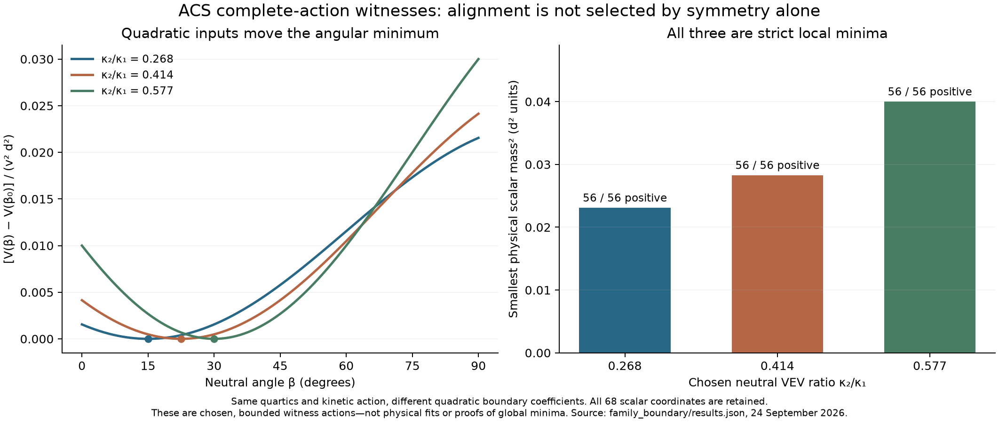

# Family count and vacuum alignment remain separate inputs

24 September 2026. **78 checks passed**, including five unchanged source replays, an exact diagnosis of the replay's apparent CKM mixing, independent fermion-loop coefficients, and three complete scalar-vacuum witnesses. The preceding [selection and energy stage](../selection_energy/README.md) is sealed separately. The original ACS goal remains active pending source-coverage and scope reconciliation.



## Retain Theorem C; remove the unsupported family identification

For T=diag(1/3,1/3,1/3,−1) on sl(4), the archived identity is correct:

\[
(\operatorname{ad}_T)^3=\frac{16}{9}\operatorname{ad}_T.
\]

Its minimal polynomial has degree three, its rank is **six**, and its kernel dimension is **nine**. The three eigenspaces have dimensions **9, 3, 3**. The source's example S03 generates a cyclic subspace of dimension **two**; adding a nonzero component in the zero eigenspace gives dimension three. These are distinct quantities.

The three charged matrix directions are related by the color action: for example, [E10,E03]=E13. They are not three copies of the same full fermion representation. More generally, diag(1/n,…,1/n,−1) on sl(n+1) has the same count of three distinct adjoint eigenvalues for every positive n, with multiplicities n²,n,n. The cubic-degree fact is a consequence of the two eigenvalue blocks, not a selector of a family multiplicity.

The inherited fermion mass constructor accepts a separate family dimension. Explicit one-, two- and four-family constructions retain the same gauge algebra and produce Weyl matrices of dimensions 16, 32 and 64. This does not establish the phenomenological viability of those models. It demonstrates that the cubic identity supplies no equation fixing that independent multiplicity to three.

`theorem_c.py` itself states the correct spectral theorem. The unsupported step occurs in the broader physical interpretation in `task_C_rigorous.py` and `task_D_lagrangian.py`. No original source is rewritten.

## The archived CKM scan cancels the parameter it scans

In `ps_yukawa_full.py`, both sectors use exactly the same dimensionless texture F(ε,phase). Substituting its normalization formulas gives

\[
M_u=\frac{m_t^{\rm input}}{\epsilon^2}F,
\qquad
M_d=\frac{m_b^{\rm input}}{\epsilon^2}F.
\]

The sinβ, cosβ, VEV and extra down-sector suppression cancel. The matrices are proportional for every shared phase input. A tanβ scan cannot select physical mixing or predict the inserted mass ratio.

The full 6,000-point source replay nevertheless prints a best phase scale of 2, tanβ≈3.1079, and apparent |Vcb|≈0.03949. That result requires a degeneracy check. At phase scale 2 the exact common texture is

\[
F=ww^T,\qquad w=(\epsilon^3/6,-\epsilon^2/2,\epsilon)^T.
\]

It has rank one and **two exactly massless modes per sector**. Independent SVD calls can choose different bases inside the two-dimensional nullspace. We explicitly rotate that nullspace while leaving the mass matrix unchanged and obtain arbitrary apparent mixing angles there. The printed near-match is therefore not a prediction for three nondegenerate quark families. Away from the degenerate texture, the shared left singular basis gives no nontrivial physical mixing.

The same replay prints zero light-family masses and a CP invariant near 6×10⁻³⁷. Its prose claims a “20% discrepancy” in |Vus|, while its own output reports a 100% discrepancy. The numerical output and algebra take precedence over that static conclusion.

## The older fixed-point scan contains its mass inputs

`phase7_qfp_yukawa.py` defines yt=mt/(v sinβ) and yb=mb/(v cosβ). Consequently,

\[
\frac{y_t}{y_b}\tan\beta=\frac{m_t^{\rm input}}{m_b^{\rm input}}
\]

identically. Its three mass inputs also mix the scales/conventions named in its own comments. The code's displayed schematic beta functions are not the complete 17-quartic beta system established in the later audit. Its full replay finds no crossing of the target quartic in the scanned range; the closest returned value is about 0.194931 versus 0.128300. This finite scan is not a proof that every possible fixed point is absent. It does not supply the missing action boundary or a new mass prediction.

## What the equal-VEV result does and does not exclude

The later Phase-52 result is retained: for real VEVs,

\[
M_u-M_d=(Y-\widetilde Y)(\kappa_1-\kappa_2).
\]

Equal positive VEVs make the matrices identical for arbitrary independent Yukawa matrices. Equal opposite VEVs give opposite matrices and therefore identical singular values. Matrix proportionality is not required for this specific obstruction. The earlier [all-angle proportionality result](../selection_energy/README.md) is a separate, stronger constraint when the Yukawa matrices themselves are proportional.

Under the explicit product-of-traces reading printed in Phase 51, the real mixed term is

\[
2\beta_c\operatorname{Tr}(\Phi^\dagger\widetilde\Phi)N_\Delta
=2\beta_c v^2d^2\sin(2\beta),
\]

twice the coefficient in that script's final potential. This factor does not change its isolated term's extrema. The historical contraction is otherwise ambiguous, so this is a check of that explicit reading, not an assignment of a unique missing index contraction.

The crucial limitation is that the complete potential contains other allowed angle-dependent terms. With Φ=v diag(cosβ,sinβ), neutral Δ norm d², and only the isotropic Phi quartic retained for this example, these include

\[
V(\beta)=\text{constant}
+\frac{v^2}{2}(m_1+\lambda_{14}d^2)\sin2\beta
-\frac{\lambda_{16}v^2d^2}{2}\cos2\beta.
\]

Thus a conclusion drawn from the isolated sin2β term does not classify vacua of the full action, nor prove that every nonzero determinant portal must be forbidden.

## Three full-action witnesses with different stable local alignments

We choose the same quartics for all three witnesses:

\[
\lambda_0=1,\quad
(\lambda_6,\lambda_7,\lambda_8,\lambda_9,\lambda_{10})=(1.2,1,1.2,1.2,1.2),
\quad\lambda_{13}=.1,\quad\lambda_{16}=.02,
\]

with the others zero, v=.3 and d=1. Only quadratic coefficients are adjusted to support the prescribed stationary backgrounds. They are recorded explicitly in `results.json`, rather than described as predictions.

The three ratios κ2/κ1 are **0.267949, 0.414214 and 0.577350**. Each has twelve gauge directions and **56 positive physical scalar mass-squared values**. The smallest are respectively about **0.023092, 0.028280 and 0.039993** in the chosen model units. Full 68-field tadpoles and gauge Ward identities pass; an independently implemented invariant projector checks angular curvatures and additional directional derivatives.

The quartics obey

\[
V_4\ge N_\Phi^2+N_\Delta^2+.09N_\Phi N_\Delta,
\]

using positivity of the projected Delta norms and |Jphi·Jdelta|≤Nphi Ndelta/2. These are bounded potentials with strict **local** minima modulo gauge directions. No global-minimum, realistic-scale-hierarchy or physical-data claim is made. The examples demonstrate nonuniqueness allowed by the inherited complete action; they do not impose the old, unestablished numerical bracket constraints.

## Removing the determinant terms needs a radiative condition

At a diagnostic point with all scalar and gauge couplings zero and real one-family Yukawas y=.2, z=.1, f=.3, the full beta function generates

\[
32\pi^2\beta_{\lambda_4}=-.064,\qquad
32\pi^2\beta_{\lambda_{14}}=-.0576.
\]

These are the Nphi Re(detPhi) and Re(detPhi) Ndelta operators. A separate calculation reconstructs them from the sixteen-entry fermion mass spectrum. With real diagonal Φ=(a,b), the two Dirac combinations are u=ya+zb and w=yb+za, and the Majorana mass is √2fd. The fourth-power Weyl trace is

\[
\operatorname{Tr}(M^\dagger M)^2
=8(u^4+w^4)+8w^2f^2d^2+4f^4d^4.
\]

The fermion box −2 times this expression yields coefficients **−64yz(y²+z²)** and **−32yzf²**, agreeing with the previously verified full beta tables. Thus setting both determinant-dependent coefficients to zero is not generically a preserved running condition. Special symmetries, vanishing Yukawas or cancellations must be specified and checked separately.

This calculation does not perform arbitrary-coupling finite Coleman-Weinberg minimization. It identifies why such a minimization would still depend on renormalized quadratic/quartic boundary values and Yukawa matrices. “Radiative” does not by itself mean “parameter-free.”

## Evidence and next boundary

`provenance.json` hashes ten unchanged source snapshots. `results.json` contains 52 checks; `verification.json` contains 26 independent/follow-up checks, including the degeneracy found in the complete replay. `attempts/` preserves all source stdout/stderr, execution wrappers and audit logs. `receipt.json` verifies this stage and the earlier sealed chain.

Reproduce from the checkout:

```sh
OPENBLAS_NUM_THREADS=1 OMP_NUM_THREADS=1 python code/condensate_energy/family_alignment_boundary.py
OPENBLAS_NUM_THREADS=1 OMP_NUM_THREADS=1 python code/condensate_energy/verify_family_boundary.py
python code/condensate_energy/publish_family_boundary.py --render-only
```

The generation, CKM and restricted alignment arguments audited here do not fill the ACS input gap. Valid algebra, conditional stable vacua and complete loop machinery remain usable. The full goal still requires reconciliation of the remaining source inventory and the microscopic-carrier identification; neither a green audit count nor this narrower report establishes that broader completion.
