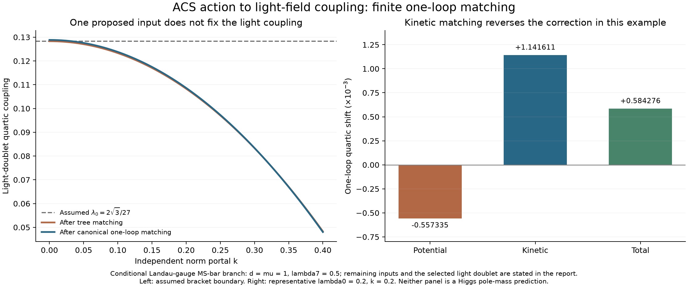

# Finite matching and the remaining ACS inputs

This stage connects a specified, stable ACS scalar action to a canonically
normalized light-doublet mass and quartic at one loop. It includes the finite
kinetic correction, scalar/vector/Majorana thresholds and mixed heavy/light
effects. Exact symbolic identities reproduce the difference between the full
and low-energy beta functions. Independent component spectra and 80-digit
light-field limits pass.

Two recovered proposals do not supply the remaining physical inputs: the archived
vacuum-selection spectrum is an eigensolver artifact, and the quoted Majorana
scale is calculated from an inserted neutrino target. The original files remain
unchanged; snapshots and replays are preserved here.



## The declared action and the selected light field

Use the complete inherited 68-real-scalar basis. Lambda6 through lambda10 are
the five Hermitian Delta invariants; lambda7 multiplies the neutral radial
invariant. The holomorphic pair is zero. The Phi quartic is lambda0 Nphi² and
the portal is k Nphi NDelta. A real determinant mass selects one light doublet
and leaves the orthogonal doublet with squared mass Mchi²>0:

\[
m_\Delta=-2\lambda_7d^2,\quad
m_0=M_\chi^2/2-kd^2,\quad m_1=-M_\chi^2,\quad m_2=0.
\]

Take Phi=h I2/2, so h is canonically normalized and Nphi=h²/2. On the neutral
heavy branch, tree elimination gives

\[
r(h)^2=d^2-\frac{k}{4\lambda_7}h^2,\qquad
\lambda_t=\lambda_0-\frac{k^2}{4\lambda_7},\qquad
V_t(h)=\lambda_t h^4/4+\text{constant}.
\]

The calculation is valid near h=0 with r²>0 and a gap for every integrated
physical field. This is an explicit light-field and boundary choice, not an
ACS prediction of that choice. Flavor is real and diagonal in this calculation,
with y_i=(Y_i+Z_i)/sqrt(2) and Majorana coupling f_i. Noncommuting flavor and
general mixed quartics are not being silently identified with this branch.

Tree stability is stronger than a radial test. If all four lambda_i-lambda7
(i=6,8,9,10) are positive and lambda_t>0, the full tree potential, up to a
constant, can be written

\[
\lambda_7\left(N_\Delta-d^2+\frac{kN_\phi}{2\lambda_7}\right)^2
+\lambda_tN_\phi^2
+M_\chi^2\left(N_\phi/2-\operatorname{Re}\det\Phi\right)
+\sum_{i=6,8,9,10}(\lambda_i-\lambda_7)I_i.
\]

Every term is nonnegative. The component checks also verify all physical Delta
gaps. The four light real Phi fields have zero tree mass and a positive quartic;
the nine gauge directions are treated consistently in Landau gauge.

## Finite potential matching

For each heavy squared-mass eigenvalue, derive

\[
x(h)=M^2+a h^2+b h^4+O(h^6).
\]

Use signed multiplicity n=+1 per real scalar, +3 per vector and -2 per Weyl
fermion. In MS-bar, c=3/2 for scalars and fermions, c=5/6 for vectors. The finite
thresholds in the potential are

\[
\Delta m^2=\frac{1}{16\pi^2}\sum n M^2a
\left(\log\frac{M^2}{\mu^2}-c+\frac12\right),
\]
\[
\Delta\lambda_V=\frac{1}{16\pi^2}\sum n\left[
2M^2b\left(\log\frac{M^2}{\mu^2}-c+\frac12\right)
+a^2\left(\log\frac{M^2}{\mu^2}-c+\frac32\right)\right].
\]

The b terms retain mixing effects that a heavy-only diagonal mass substitution
would miss. The executable derives the radial/light, charged-vector/light,
neutral-vector/light and seesaw eigenvalues from their characteristic equations.
It also includes all fifty transverse massive Delta modes, the heavy Phi doublet
and the six color vectors. Closed spectra match the full component Hessian,
21-vector Gram and 16n-Weyl matrix at multiple backgrounds and boundary choices.

The light effective-theory potential must be subtracted before taking the
quartic limit. Its h⁴ log(h²) terms cancel those of the light modes in the full
theory. Eighty-digit limits reproduce the analytic thresholds. The unsubtracted
potential fails that same limit, as expected.

## Kinetic matching changes the answer

The canonically normalized result is

\[
\lambda_{\rm EFT}=\lambda_t+\Delta\lambda_V-2\lambda_t\Delta Z.
\]

Set T=3g4²+2gR², MWR²=gR²d², MZR²=Td² and MNi²=2f_i²d². In this branch,

\[
\Delta Z_s=\frac{k^2}{64\pi^2\lambda_7},
\]
\[
\Delta Z_V=\frac{1}{16\pi^2}\left[
\frac{g_R^2}{2}\left(3\log\frac{M_{WR}^2}{\mu^2}-\frac52\right)
+\frac{g_R^4}{2T}\left(3\log\frac{M_{ZR}^2}{\mu^2}-\frac52\right)\right],
\]
\[
\Delta Z_F=\frac{1}{16\pi^2}\sum_i y_i^2
\left(\frac12-\log\frac{M_{Ni}^2}{\mu^2}\right).
\]

The scalar cubic is A=sqrt(2)kd. The regulated scalar bubble has
B'(0;M²,0)=-1/(32pi²M²), giving DeltaZ_s=A²/(32pi²M²). Independent component
derivatives reproduce A; Feynman-parameter quadrature reproduces the derivative.
After translating field-rescaling conventions, the result agrees with
[Haisch et al., equation 11](https://arxiv.org/html/2003.05936v2).

For the massive vector/light scalar loop, the transverse numerator contributes
4(1-1/D) p², D=4-2epsilon. Multiplying the regulated bubble before subtracting
the pole gives 5/2-3 log(M²/mu²), not 3-3 log(M²/mu²). The minus sign comes
from the gauge/scalar mixing contribution to the two-point function. Component
generators independently reproduce both heavy-vector weights in DeltaZ_V.

For the Majorana/light-fermion loop, differentiating the two-point function
gives the combination B(0)+M²B'(0), hence 1/2-log(M²/mu²). At zero portal, the
complete diagonal seesaw quartic correction agrees with the zero-light-mass
limit of [Zhang and Zhou, equation 90](https://arxiv.org/html/2107.12133v2).

The exact archived full-theory beta tensors provide another independent test.
For arbitrary stable lambda6..lambda10, k, lambda0, gauge couplings and diagonal
flavor, the explicit matching-scale derivative plus the full-theory running
equals the low-energy beta function. The mass identity also closes exactly.
Omitting DeltaZ leaves a nonzero symbolic residual. This is recorded in
[exact-RG.json](exact-RG.json), rather than inferred from a few fitted points.

## Representative numerical result

At lambda0=.2, (lambda6,...,lambda10)=(.6,.5,.6,.6,.6), k=.2,
(g4,gL,gR)=(.3,.25,.35), d=mu=1, Mchi²=.7,
f=(.2,.3,.4) and y=(.07,.11,.16):

- Tree matched quartic: **0.180000000**.
- Potential-only loop shift: **-0.000557335**.
- Kinetic contribution to the quartic: **+0.001141611**.
- Canonical one-loop matched quartic: **0.180584276**.
- Finite light mass term: **Delta m²/d²=-0.001198421**.

Thus omitting the kinetic term reverses the sign of the total quartic correction
in this example. A zero tree light mass also does not remain zero after matching.
Changing the declared heavy couplings gives either sign for the finite mass
threshold in the tested cases. This is a conditional threshold result, not a
prediction of the measured Higgs mass or a dynamically selected hierarchy.

The plot additionally treats lambda0=2sqrt(3)/27 as an **assumed** input and
shows its portal-dependent matching. Even accepting that proposed high-scale
number does not fix the low-energy quartic. Unit rescaling leaves the matched
dimensionless coupling invariant; changing independent couplings does not.
Varying the renormalization scale at fixed running boundary data reproduces
low-energy evolution. Resetting boundary couplings at each scale would instead
change the model.

## Testing recovered proposed inputs

The Seagate file `electroweak_vacuum_selection.py` constructs a real matrix T
and sets M=Re[i Sym(T)+Anti(T)]=Anti(T). It then calls `eigvalsh(M)`. That routine
assumes a Hermitian input and reads one triangle accordingly; M is instead
skew-symmetric. In this particular construction the fourth direction is inactive,
and exact algebra gives

\[
\det(zI-M)=z^2(z^2+\Omega^2),\qquad
\Omega^2=\frac{183409\phi^4+772460\phi^3+1006300\phi^2+54000\phi+90000}{4000000}.
\]

The true nonzero eigenvalue magnitudes are equal, and the third magnitude is
zero. At phi=1.2, the source procedure returns approximately (.928472,.892261,
.036211,0); true eigenvalue magnitudes, singular values and the Hermitian
operator -iM all return (.910906,.910906,0,0). This operator cannot supply three
positive generation masses. Replaying the original still selects phi=1.22 by
comparison with its inserted target angle; that selection does not survive the
correct spectral interpretation and does not minimize an action.

The Seagate file `neutrino_honest.py` calculates a Dirac input about 48.9853 eV
from charged-lepton inputs and its assumed suppression rule. Inserting the
target .049 eV into MR=mD²/mnu then gives MR about 48.9706 keV. Halving the
target doubles the inferred MR. This is inverse parameter inference, not an
independent selection of F or d. An earlier literal in the same script uses
.049e-3 MeV, which is 49 eV; it should be .049e-6 MeV for the stated target.
The two calculations therefore differ by a factor of 1000. The target is treated
here as an archived input, not an absolute neutrino-mass measurement.

These findings close those two proposed routes to the missing inputs. They do
not refute unrelated ACS constructions or establish that every archive has been
searched. See [source provenance](source-snapshots/provenance.json),
[source audit](archive-inputs.json), and the preserved original replays.

## Scope and next unresolved work

The dimension-four matching link is now derived and checked for this stable
norm-portal branch with a selected real light doublet and diagonal flavor.
General mixed quartics and noncommuting flavor need their own matching; a
momentum-dependent pole mass and the complete dimension-six EFT are separate
calculations. No action normalization, vacuum scale or flavor boundary has been
selected by this result.

The broader investigation remains active. Next, reconcile the remaining
action/kinetic and flavor-selection proposals against these demonstrated input
requirements, extend surviving calculable routes, and audit completion against
the original scope. Green checks on this branch do not close those obligations.

## Reproduction

From the repository root, using NumPy, SciPy, SymPy, mpmath and Matplotlib:

```sh
python code/condensate_energy/finite_light_matching.py
python code/condensate_energy/verify_finite_matching.py
python code/condensate_energy/exact_matching_rg.py
python code/condensate_energy/archive_matching_inputs.py
python code/condensate_energy/seal_finite_matching.py
```

Set OPENBLAS_NUM_THREADS=1 and OMP_NUM_THREADS=1. The [protocol](protocol.md),
[matching results](matching.json), [independent verification](verification.json),
[exact RG identities](exact-RG.json), [archive-input audit](archive-inputs.json)
and [receipt](receipt.json) separate assumptions, calculations and findings.
The initial mislabeled control set and the initial unsimplified symbolic
comparison failure remain under `attempts/`; earlier sealed artifacts are
verified before sealing this stage.
