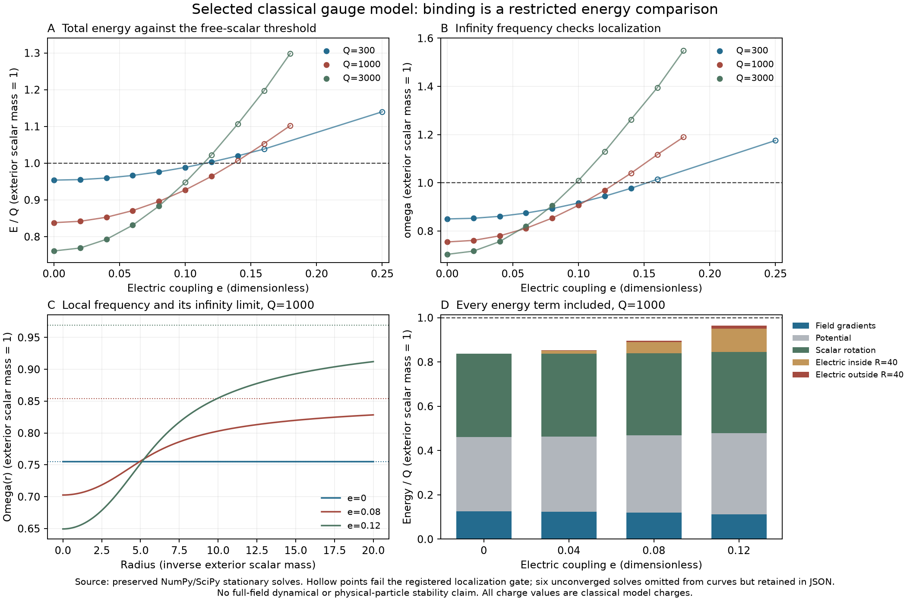

# Gauge completion: a surviving reduced branch and the full-field boundary

Status: **qualified classical scalar–electric solutions; no ACS particle or
full-theory stability identification**. All quantities below are dimensionless,
with the exterior q mass set to 1. This work extends the existing
[self-binding](../self_binding/README.md), [charge audit](../charge_audit/README.md)
and [charge leakage](../charge_leakage/README.md) experiments.

The reduced localized branch survives a weak electric coupling when both the
Gauss constraint and the entire electric field energy are included. An
independent finite-volume minimization reproduces it. But identifying the
charge with an existing ACS generator introduces additional charge carriers;
the selected vacuum has massless charged gauge vectors. The old scalar-only
binding inequality is therefore not a stability certificate for the full
theory. A different physical vacuum and the actual carrier spectrum must be
derived before making that claim.

## What was run

The primary record contains **45 boundary-value solves**: 36 points across
Q=300,1000,3000 and twelve electric couplings, five charge continuation steps,
and four domain/tolerance checks. **Six solver failures are retained**; they
are not evidence of nonexistence. Fifteen further solves compare product
energies and check the chemical potential. Six independent finite-volume
minimizations check the reference profiles. There are **45 passing registered
or exact qualification checks** across the six result files; these checks
qualify specified claims, not every survey point or full nonlinear stability.



At Q=1000 the total energy per charge is **0.83816310** for e=0,
**0.85287361** for e=.04, **0.89589574** for e=.08 and **0.96420948**
for e=.12. Their infinity frequencies are respectively **.75488821,
.78026249, .85389132 and .96932000**. All four are below the free-q threshold.

At e=.12, the electric field costs **119.381751** energy units. Of this,
**14.323945 lies beyond the radius-40 numerical domain**. Omitting it would
produce a false binding margin. The 90%-charge radius grows from 5.67947
at e=0 to 6.33061 at e=.12.

The survey also distinguishes localization from binding. Q=300,e=.12 has
omega=.944778 but E/Q=1.003183: being localized does not place its energy
below free scalar waves. Q=3000,e=.10 gives E/Q=.947561 but omega=1.009847:
its small finite-box tail cannot certify an infinite-space bound state.
For omega>1 the exterior radial equation eventually has oscillatory tails.
The Coulomb potential can postpone that transition far beyond the box.
The special omega=1 threshold is not classified by these strictly
below-threshold tests.

## Equations and independent qualification

The earlier potential is retained:

\[
U=(\chi^2-1)^2/4+\chi^2|q|^2/2+b|q|^4/4,
\qquad b=2\sqrt3/27.
\]

Use \(D_\mu q=(\partial_\mu-ieA_\mu)q\), the canonical Maxwell term,
and \(q=f(r)e^{i\omega t}\). For \(\Omega=\omega-eA_0\),

\[
\chi''+2\chi'/r=\chi(\chi^2-1+f^2),\quad
f''+2f'/r=(\chi^2-\Omega^2)f+bf^3,\quad
\Omega''+2\Omega'/r=e^2f^2\Omega.
\]

Charge is \(Q=4\pi\int r^2\Omega f^2dr\). The infinity convention is
A0(infinity)=0, so omega is the chemical potential in that convention.
At a large radius R,

\[
\omega=\Omega(R)+R\Omega'(R),\quad
E_{\rm outside}=\frac{e^2Q^2}{8\pi R}.
\]

The primary energy calculation uses the independently measured boundary
flux and checks it against Q. It also checks

\[
T+E_{\rm electric}=\omega Q/2,\qquad
G+3V-3T-E_{\rm electric}=0.
\]

For the four reference points, Gauss discrepancies are below 2.2e-10,
energy-identity discrepancies below 6.4e-11 and relative virial discrepancies
below 7.6e-10. Extending the domain from 40 to 60 at e=.08 and .12 changes
energy and frequency by at most 5.1e-13 in the sampled comparisons; tightening
the BVP tolerance changes them by at most 2.0e-10. These small changes show
insensitivity of these observables, not universal accuracy of that many digits.

The independent method eliminates the discrete electrostatic potential
exactly at each trial profile and minimizes energy at fixed Q. Its analytic
gradient and Hessian match finite differences to 6.56e-9 and 5.27e-11 in
the registered tests. At spacings .1 then .05, energy errors decrease by
approximately four. Fine-grid relative differences from the continuum are
9.48e-6, 7.06e-6 and 4.83e-6 for e=0,.08,.12. All weighted-gradient norms
are below 8.8e-9. This is a different stationary discretization and variational
method; neither calculation is a full dynamical gauge simulation.

The extra charge solves verify dE/dQ=omega to relative error below 1.9e-8.
For Q=1000,e=.12, splitting into 500+500 costs **13.04830 more energy**;
400+600 costs **13.26688 more** at infinite separation. Both tested partitions
also cost more at e=0 and .08. These comparisons do not exclude other
partitions, nonradial disturbances or a different branch. No fission rate
or barrier was computed.

## An actual existing gauge generator

In the inherited Phi(1,2,2), Delta(bar10,1,3) convention, choose the
classical scalar slice

\[
\Phi=\chi I_2/2,\quad D_1=D_2=0,\quad D_3=qE_{44}/\sqrt2,
\qquad T^{15}=\frac{\mathrm{diag}(1,1,1,-3)}{2\sqrt6}.
\]

Its norm invariants are Nphi=chi²/2 and NDelta=|q|²/2. The selected
gauge-invariant potential is
\((N_\Phi-1/2)^2+2N_\Phi N_\Delta+bN_\Delta^2\).
The kinetic terms match the reduced model exactly. The Delta component
has T15 weight \(\sqrt{3/2}\), so **e=sqrt(3/2) g4** in the specified
canonical generator normalization. Fourteen other color current projections
and the three weak triplet current projections vanish on this slice.
Classical fermions and the other gauge fields may consistently be zero
for this selected action; that does not remove their fluctuations or
their emission channels from the full theory.

The allowed holomorphic Delta quartic HDelta and its **full first derivative**
vanish on this rank-one slice. Every determinant in its polarization formula
has rank at most one, so every cofactor vanishes. Thus the slice is not
being kept alive by illegally deleting a charged q^4 operator. A single q^4
term would violate this gauge charge; the complete HDelta remains gauge
invariant and acts in other directions. Its vanishing here does not protect
the slice against those directions. Other permitted scalar coefficients are
selected in this test, not derived or proved zero.

This uses an existing gauge generator, not a gauged version of the anomalous
global X found in the earlier audit. The vectorlike SU(4) fermion content
cancels gauge anomalies; the checked T15 cubic and mixed weak traces vanish,
and each weak group has an even number of Weyl doublets. The global-X
anomaly obstruction is unchanged.

## Why this is not yet full-theory binding

At the selected exterior vacuum Phi=I2/2, Delta=0, the complete
21-generator gauge mass Gram has **18 zero eigenvalues** and three
eigenvalues 1/2 when gauge couplings are set to 1 for this rank calculation.
SU(4) remains unbroken. Its three complex off-diagonal color–lepton vector
pairs are massless and have T15 charge magnitude **2/3 of the selected
Delta component's charge**. Their charge weights and zero masses are exact
representation/vacuum calculations. They expose an omitted, gapless charged
sector; E<Q only compares with the massive q waves.

The charge is specified in a fixed asymptotic Cartan convention. These
calculations do not establish a gauge-invariant colored elementary particle,
construct a full non-Abelian Gauss-constrained decay trajectory, or calculate
quantum confinement or an emission rate. In particular, a kinematically
available sector is not a measured decay. What fails is the proposed
inference from scalar-only binding to full-theory stability.

The selected norm potential also has seven zero scalar Hessian modes in Phi,
three eaten by the broken weak generators, leaving **four physical tree-level
flat scalar directions**. Its remaining scalar mass-squared eigenvalues are
one radial value 2 and sixty Delta values 1. General angular quartics lift or
change this spectrum. The chosen vacuum is not the realistic flavor vacuum
of the source manuscript.

Fermion carriers provide another explicit test. An antilepton has half the
T15 charge of the selected Delta component; the Delta R R coupling permits
the appropriate pair. For equal carrier masses m_f, complete free-pair
dispersal is energetically allowed if 2m_f<E/Q, while infinitesimal pair
emission is kinematically open if 2m_f<omega. At e=.08 these thresholds are
m_f<**.44794787** and m_f<**.42694566**, respectively. They are different
tests and neither is a decay-width calculation.

The source-convention Dirac mass in this selected vacuum is (Y+Z)/2.
Even retaining **Z=(2/3)Y**, Y=(1/10)I gives m_f=1/12 and open pair
thresholds, while Y=I gives m_f=5/6 and closed thresholds. Both satisfy the
same ratio and gauge representation content. Neither is asserted to be
the physical choice. This exact counterexample shows why a ratio alone
cannot settle the carrier question.

## The conventional physical-vacuum alternative

A distinct neutral-Delta exterior can leave SU(3)c×U(1)em after the
bidoublet condenses. The exact second mass-Gram test uses unequal diagonal
Phi entries and the m_R=-1 anti-lepton-pair Delta direction; its nullity
is nine, with the usual electromagnetic generator
\(Q_{\rm em}=T^3_L+T^3_R+(B-L)/2\) explicitly in the nullspace.

The neutral Delta component has electric charge **zero**; it cannot carry
the proposed nonzero electromagnetic rotor charge. The other two
anti-lepton-pair components have charges **+1 and +2** and are possible
charged candidates. Their masses, binding potentials, mixing with the
neutral condensate, heavy-gauge response and lepton thresholds depend on
the selected full potential and Yukawas. Applying the previous single-field
profile to that different vacuum would not be a derived reduction. The
calculated mass Gram identifies the symmetry correctly, but does not select
this vacuum or determine a particle mass.

## What the source can and cannot select

The inherited invariant-theory result has **17 real quartics and four real
quadratic coefficients**. The source RG report, section 5, explicitly leaves
the chosen vacuum, canonical mass matrices, light-field projectors and finite
matching open. The canonical manuscript also records incomplete kinetic
matching near its proposed Higgs quartic. That proposed Phi quartic is not
a derivation of the independent Delta quartic b used here.

Two exact controls sharpen this boundary. First, for general positive
coefficients the completed square

\[
U-\frac{g^2v^2f^2}{2}=
\frac{\lambda_\chi}{4}\left(\chi^2-v^2+
\frac{g^2}{\lambda_\chi}f^2\right)^2+
\frac14\left(b-\frac{g^4}{\lambda_\chi}\right)f^4
\]

proves E>=g v |Q| when b>=g^4/lambda_chi, including positive electric
energy. Gauge-invariant norm potentials therefore allow both the measured
binding example and a no-binding region. This refutes determination by
gauge content alone, not every proposed additional ACS selection rule.

Second, scaling every dimensionful parameter consistently by a preserves
dimensionless classical equations and Q, while multiplying energies by a
and dividing lengths and times by a. Without a selected physical scale,
no result in seconds, GeV or meters follows from these dimensionless runs.
Quantum running can introduce additional scale information only with its
own boundary conditions; it was not computed or selected here.

## Reproduce and inspect

Run these commands separately from the repository root with NumPy, SciPy,
SymPy and Matplotlib. The baseline survey preserves failed cases by design.

```sh
OPENBLAS_NUM_THREADS=1 OMP_NUM_THREADS=1 python code/condensate_energy/gauge_completion.py
OPENBLAS_NUM_THREADS=1 OMP_NUM_THREADS=1 python code/condensate_energy/gauge_finite_volume.py
python code/condensate_energy/gauge_carrier_contract.py
OPENBLAS_NUM_THREADS=1 OMP_NUM_THREADS=1 python code/condensate_energy/gauge_fission.py
python code/condensate_energy/parameter_identifiability.py
python code/condensate_energy/carrier_threshold_countermodels.py
python code/condensate_energy/summarize_gauge_completion.py
```

`protocol.md` preceded the primary runs. `fission-protocol.md` identifies the
later hypothesis and its tests. The original survey source and outcomes are
frozen under `attempts/`. The first fission run completed its solves but hit a
NumPy boolean JSON-conversion error; its source and failure record are retained
under `attempts/fission-serialization/`. Converting that comparison to native
bool repaired output without changing equations or tolerances.

`assessment.json` summarizes the evidence. `receipt.json` hashes all new
artifacts and verifies the earlier self-binding, charge-audit and
charge-leakage records remained unchanged. Source manuscripts and standing
rules were not edited. The final cross-branch assessment is
[the condensate investigation conclusion](../investigation-conclusion.md).

Gauged FLS solitons are an established research direction; see the primary
study by [Loiko and Shnir](https://arxiv.org/abs/1906.01943). Its model and
results motivate checking the gauge sector, not importing its numerical
parameters or stability conclusions into ACS. All numerical values above
come from the preserved experiments in this repository.
