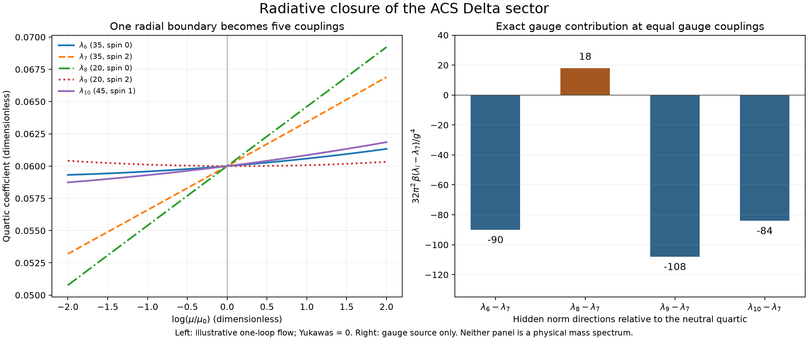

# Hidden couplings: which omissions survive quantum corrections?

The earlier neutral-vacuum audit exposed six invisible interactions. This continuation
separates them: **the four hidden norm couplings are generally regenerated by loops;
the two holomorphic couplings form a zero surface preserved by the full one-loop
equations.** The old two-trace Delta potential is not closed under renormalization.

61 checks pass, including exact gauge and scalar polynomial identities.
These results apply to the declared minimal unbroken theory. They do not select the
ACS boundary coefficients, establish a physical vacuum, or compute pole masses.



## What is now fixed by the calculation

Use the [same canonical fields and invariant basis](../canonical_vacuum/README.md).
Indices are zero-based, and \(B=32\pi^2d/d\log\mu\). The five Hermitian Delta
quartics \(I_6,\ldots,I_{10}\) sum to \(N_\Delta^2\). Only \(I_7\) survives
on the rank-one neutral slice. Their pure gauge source is exactly

\[
B\begin{pmatrix}\lambda_6\\\lambda_7\\\lambda_8\\\lambda_9\\\lambda_{10}\end{pmatrix}_{\!\mathrm{gauge\ source}}
=g_4^4\begin{pmatrix}45\\45\\9\\9\\-3\end{pmatrix}
+g_4^2g_R^2\begin{pmatrix}-72\\36\\72\\-36\\12\end{pmatrix}
+g_R^4\begin{pmatrix}36\\18\\36\\18\\6\end{pmatrix}.
\]

These are additive terms in the beta function, not the entire beta function.
Scalar, Yukawa, and gauge wave terms must also be included. Special cancellations
at particular parameter values do not make a truncation generally invariant.

All six gauge-square coefficients in the **full 17-quartic basis** were rebuilt
from the 21 infinitesimal gauge actions and the kinetic metric, then compared
exactly on every monomial with the archived table. No fitting or finite field
sample supplies this identity. The source has 5,106, 0, 4,158, 36, 44, and 2,916
nonzero monomials in gauge-pair order (44, 4L, 4R, LL, LR, RR).

A radial scalar potential \(\rho N_\Delta^2\), with gauge and Yukawa interactions
turned off, has \(B\lambda_i=272\rho^2\) for all five indices. This is the
preservation control. Gauge interactions break that equality. A Majorana fermion
box independently contributes
\(\operatorname{Tr}[(F^\dagger F)^2](4,-8,-2,4,0)\).

The radial and gauge source vectors span four directions; the Majorana box lies
in that span. Applying the scalar-loop contraction to the gauge-generated vector
\((45,45,9,9,-3)\) produces

\[
(212112,212112,96336,96336,66960),
\]

which adds the fifth independent direction. We verified this scalar-loop result
directly as the exact polynomial \(\operatorname{Tr}(G^{-1}HG^{-1}H)\).
Thus the five-operator Hermitian Delta space is required for generic independent
gauge couplings. This is an operator-closure statement, not a claim that all five
boundary values must be independently fitted if ACS eventually derives relations.

## A defensible zero surface, with a precise limitation

For \(V_H=\lambda_{11}\operatorname{Re}H+\lambda_{12}\operatorname{Im}H\), the complete
one-loop result, with arbitrary complex family matrices and symmetric F, is

\[
B\lambda_j=\left[\frac{80}{3}\lambda_8+\frac{64}{3}\lambda_9
-108g_4^2-48g_R^2+8\operatorname{Tr}(F^\dagger F)\right]\lambda_j,
\qquad j=11,12.
\]

Both coefficients can therefore remain zero if they are zero at the boundary.
Neither scalar loops, gauge sources nor fermion boxes force them to become nonzero
at this order. We checked every relevant coefficient in the full archived polynomial,
not merely several flavor choices. Nonzero initial values remain undetermined.

The selection rule is the [previously identified classical X charge](../charge_audit/README.md).
In physical chirality notation \(X(\Phi,\Delta,\psi_L,\psi_R)=(0,-2,1,1)\).
In the all-left-handed Weyl implementation, the conjugate R field has charge -1,
and its Majorana vertex uses Delta conjugate. All Yukawa vertices are neutral.
Exact differentiation of the scalar polynomials gives \(X I_i=0\) for the other
15 quartics, \(X\operatorname{Re}H=8\operatorname{Im}H\), and
\(X\operatorname{Im}H=-8\operatorname{Re}H\). This explains the perturbative
selection rule; the explicit beta calculation here is one-loop.

The weak mixed anomalies found earlier remain. A protected zero in these beta
functions is **not** a proof of an exact quantum global charge or of stable charged
matter. Setting the pair to zero is an explicit boundary assumption, not an ACS
prediction inferred from its absence in a neutral calculation.

## The historical rho equation needs an index definition and a matching scale

The old [printed potential](../../../code/acs_codebase/extras/task2_lagrangian.py)
and [Task D discussion](../../../code/acs_codebase/extras/task_D_lagrangian.py)
use \(\rho_1 N_\Delta^2+\rho_2\operatorname{Tr}[(\Delta^\dagger\Delta)^2]\)
and claim \(2\rho_1+\rho_2=16/9\). For three symmetric color matrices D_a,
two gauge-invariant readings of that trace are

\[
A=\operatorname{Tr}_4\left[(\sum_aD_a^\dagger D_a)^2\right]
=I_6+I_7-\tfrac12I_8-\tfrac12I_9,
\]
\[
C=\sum_{ab}|\operatorname{Tr}_4(D_a^\dagger D_b)|^2
=I_6+I_7+I_8+I_9-I_{10}.
\]

Both equal \(N_\Delta^2\) on the old neutral slice. They disagree elsewhere:
for \(D_1=I_4,D_2=D_3=0\), A=4 and C=16. Both expansions were checked on
every monomial. We have not assigned either reading to the historical rho2 without
an explicit source contraction. The [conditional mappings](results.json) retain both.

Even giving the source relation its stated value does not repair radiative closure.
Take \(\rho_1=8/9,\rho_2=0\), all gauge couplings 4/3, zero Yukawas and other
quartics. This point belongs to both readings and satisfies the claimed relation.
Both two-trace ansatze require \(\lambda_6=\lambda_7\), but the complete one-loop
equations give the exact transverse derivative

\[
B(\lambda_6-\lambda_7)=-\frac{2560}{9}\ne0.
\]

This is an algebraic counterexample to preserving either old two-trace ansatz as a
running action. It is not a physical-vacuum example. A source relation may still be
imposed at a specified matching scale, followed by evolution of the complete basis.

## How this helps finish the framework

The scalar implementation now has a concrete closure requirement: retain all five
Hermitian Delta quartics. A 15-quartic branch with lambda11=lambda12=0 is consistent
with the full one-loop flow when explicitly selected; the unrestricted theory keeps
all 17. The neutral stability check remains insufficient in either branch, so use
the [68-field canonical Hessian](../canonical_vacuum/README.md).

The remaining input is specific: a normalized, index-explicit ACS action or matching
prescription that assigns coefficients at a declared scale. A single rho equation
cannot determine the full Delta sector. RG equations determine changes between
scales once boundary data are given; they do not determine their integration constants.
Finite threshold matching and a physical mass spectrum still require those data.

## Verification and reproduction

The general one-loop convention follows [Luo, Wang and Xiao, equations 38–43 and
the semisimple extension](https://arxiv.org/html/hep-ph/0211440v3). Their paper supplies
the general equations; the ACS coefficients above come from the local calculations.
The archived inputs are preserved in [source-snapshots](source-snapshots/provenance.json).

Six independent component evaluations, at one, two, and three families, compare the
assembled full beta potential with the canonical scalar Hessian, vector Gram,
fermion mass matrix, and wave terms. Largest normalized residual: 4.02e-16.
These numeric checks supplement the exact identities; they do not replace them.

An illustrative zero-Yukawa trajectory starts with lambda0=.08, lambda6 through
lambda10=.06, lambda13=.02, other quartics zero, and (g4,gL,gR)=(.3,.25,.35).
On log(mu/mu0) from -2 to +2, all five norm coefficients separate while the
holomorphic pair remains exactly zero. Two solver tolerances agree within 1.28e-14;
reverse integration and the initial derivative also pass. This is not a physical
ACS parameter estimate or a claim of radiative vacuum stabilization.

Run from the repository root with NumPy, SciPy, SymPy and Matplotlib available:

```sh
OPENBLAS_NUM_THREADS=1 OMP_NUM_THREADS=1 python code/condensate_energy/hidden_coupling_audit.py
OPENBLAS_NUM_THREADS=1 OMP_NUM_THREADS=1 python code/condensate_energy/hidden_coupling_witnesses.py
python code/condensate_energy/summarize_hidden_couplings.py
```

The complete outputs are [results.json](results.json), [exact-witnesses.json](exact-witnesses.json),
[assessment.json](assessment.json), and [receipt.json](receipt.json). All prior canonical
artifacts and the four ancestral receipts were verified unchanged. No manuscript,
standing rule, or earlier result was rewritten.
