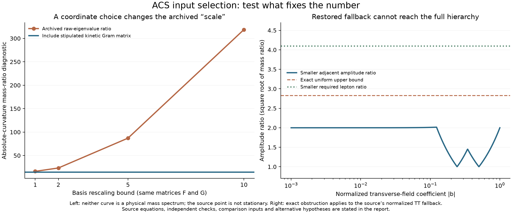

# Do the recovered proposals select the missing ACS inputs?

**Not yet. This stage closes several specific proposed selectors, corrects one overly broad negative result, and restores previously unread source material. The wider investigation remains active.** There are 92 passing scoped checks (58 exact/source checks, 26 independent controls, 8 fallback-resolution checks). Passing checks here establish identities, counterexamples and replay agreement; they do not validate the surrounding historical claims.

The [source provenance](provenance.json), [recovered Claude attachment](gfe-cutoff-attachment.txt), [project-export provenance](export-provenance.json), and [coverage record](source-coverage.json) distinguish recovered content from claims actually tested. All original sources and previous sealed stages remain unchanged.



## 1. The archived VEV projection is identically zero

`koide_from_vev.py` uses real matrices, a real symmetric VEV V, and

\[
J(L)=i\,\mathrm{Sym}(L)+\mathrm{Anti}(L),\qquad
y(L,V)=\operatorname{Re}\operatorname{Tr}(J(L)V^\dagger).
\]

The symmetric contribution is purely imaginary. The antisymmetric contribution has zero trace against a symmetric matrix. Therefore **y=0 for every allowed L and V**, not just the tested samples. The exact basis calculation covers all 16 real matrix directions against all 10 symmetric directions. The extracted original function confirms the identity up to rounding in 100 random controls. Its 100,000-direction search cannot repair this algebraic zero.

An explicit change to `Im Tr(J(L)V)` gives a nonzero map. For the source's three bracket levels it is a rank-three map from the nine-dimensional symmetric traceless VEV space. Its six-dimensional kernel leaves freedom. An exact right inverse constructs VEVs realizing arbitrary nonzero amplitude ratios; normalizing the VEV changes the common scale, not the ratios. Three distinct ratios are constructed in the [results](selector-results.json).

This repair permits fitting. It does not choose the VEV direction. Also, the source's 4×4 symmetric matrix is not automatically the action's complex 2×2 bidoublet: that representation map remains a separate requirement.

## 2. The proposed curvature scale is not a physical vacuum calculation

The source fixes F and G using coefficients 0.3 and 1.22, and defines

\[
I=\|F\|_F^2-\|[F,G]\|_F^2+
\|[[F,G],F]+[[F,G],G]\|_F^2.
\]

At its claimed vacuum, the exact evaluation gives:

- I = **0.59467989793424**, not zero;
- the source-coordinate gradient norm is **5.91336**, not zero;
- the point is not stationary even after restricting Form to fixed Frobenius norm;
- F=0 gives I²=0, lower than the proposed point's I²;
- both the I Hessian and the corrected I² Hessian have a negative eigenvalue at this point. These are nonstationary curvatures, not vacuum mass spectra.

The source computes the Hessian of I while discussing the potential I². The actual relation is

\[
H_{I^2}=2(\nabla I)(\nabla I)^T+2I H_I.
\]

Exact derivative formulas, direct symbolic polynomial differentiation, the archived finite-difference function, and independent 85-digit directional differentiation agree. The source's absolute-eigenvalue operation conceals the negative direction.

Its basis is also not orthonormal. If a Frobenius kinetic term is stipulated, the appropriate spectral diagnostic is the generalized eigenproblem H v = m² G v, where G is the kinetic Gram matrix. Under a constant basis change C, both matrices transform: H→CᵀHC and G→CᵀGC.

Changing only basis coordinates changes the source's raw absolute-curvature ratio from **16.1724** to **23.3970**, **87.0850**, and **318.7473**. The generalized spectrum stays invariant to floating-point precision. Including G fixes the coordinate defect; it does not turn this nonstationary point or the assumed kinetic normalization into a derived physical vacuum.

The unmodified source replay prints **3978.42 GeV** and **0.0656343 eV**. These reproduce its calculation, using inserted 246 GeV and 0.511 MeV values. The printed static conclusion rounds these to approximately 3.9 TeV and 0.067 eV. Reproducibility alone does not establish its claimed derivation.

## 3. The computed block complement does not enter that neutrino result

For the source's actual matrices, the fourth row and column of [F,G] vanish. Its 3×3 quark block has rank two and no inverse. Both mixing vectors and the lepton scalar are zero. The pseudoinverse expression used in the script is therefore exactly zero. An AST read-use check shows the resulting `S_dimless` is never read afterwards; the final mass instead uses the inserted electron mass squared divided by the proposed curvature scale.

The separate geometric-seesaw proposal also needs a representation check. Under unbroken color SU(3), a triplet cannot supply a nonzero invariant mixing vector with a singlet. The eight fundamental generators have no common kernel; their quadratic Casimir is 4/3 times the identity. Quark–neutrino mixing of this form therefore needs additional color-breaking structure. A color-singlet heavy neutrino remains an admissible seesaw construction, with independent mass/Yukawa inputs. The source's correct identity `[symmetric, antisymmetric] = symmetric` is retained.

## 4. A historical negative result was too broad; the repaired conclusion is narrower

The current `vacuum_theta0.py` and ledger say their physical selector annihilates the bracket hierarchy. Its primary projector indeed commutes with the supplied transverse matrices. **The fallback actually implemented in that same script does not.** We preserved the current source version separately to make this distinction reviewable.

Write the normalized transverse form as h=aD+bS, a²+b²=1, using the source's first two matrix coordinates. Its fallback is g=[diag(1,0,0,0),h]. The three squared chirality/Frobenius norms are exactly

\[
2(a^2+b^2),\quad
8b^2(a^2+b^2),\quad
32b^2(a^2+b^2)(a^2+2b^2).
\]

Thus they are nonzero for b≠0. For example, (a,b)=(3/5,4/5) gives squared norms (2,5.12,33.5872). The blanket annihilation claim is false for the implemented fallback.

We then followed the restored family to its own endpoint. After removing a common factor, its amplitudes are

\[
(1,\;2|b|,\;4|b|\sqrt{1+b^2}),\qquad 0<|b|\le1.
\]

The ratio of the last two amplitudes is at most 2√2. Whether or not the first amplitude lies between them, **at least one adjacent ratio after sorting must be at most 2√2**. The archived charged-lepton comparison inputs (from `theta0_derivation_suite.py:67`) require adjacent square-root-mass ratios **14.3794 and 4.10086**, both greater than 2√2. This exact bound excludes the normalized source family under its stated mass∝y² interpretation.

It nevertheless has a Koide Q=2/3 solution at |b|≈0.04081124. Its two adjacent ratios are approximately **2.00166 and 6.12067**, not the required pair. A 70-digit calculation confirms that root. Satisfying the aggregate Koide relation is therefore insufficient. Independent momentum/amplitude scales or different field families would be new hypotheses, not this source calculation.

## 5. The recovered cutoff attachment does not derive the fine-structure value

The full 195-line attachment was recovered from **Asymmetric codependent systems and free parameters**, using Claude's copy control and a blank local text document. The earlier chat response had not read it. Its asserted chain fails at several independently checkable steps:

1. The matrix `[[1,2],[0,1]]` acts by τ→τ+2. It has no finite fixed point in the upper half-plane; τ=i/2 leaves a residual of 2. Passing to modular equivalence does not single out one torus aspect ratio either.
2. Integer Fourier modes do not satisfy the asserted antiperiodic condition. For a rectangular torus with only its first cycle antiperiodic, the minimal scalar eigenvalue is 1/(4R²), with an allowed zero mode on the second cycle. With periodic cycles the first positive eigenvalue is min(1/R²,1/a²). A quotient, field bundle or tensor parity can impose different restrictions; those must be specified. Nonorientability alone does not force all scalar functions to be antiperiodic, as an explicit Klein-quotient scalar shows.
3. The two asserted exact equalities λ₀=1/R²+1/a² and λ₀=1/a² contradict each other for finite R. An approximation needs a stated regime and error; it cannot select a unique ratio.
4. A finite-volume integral of a positive constant 1/λ₀ is finite for many positive a/R. Convergence alone does not imply the displayed equality. Four explicit alternate ratios are retained. On infinite spacetime, a constant integrand instead requires a volume/regularization prescription.
5. Substitution of a/R=8 exp(-(K−1)) into log(8R/a)+1 returns **any preselected K**. The value 136.035999171 appears in the exponent before the claimed result is obtained. No beta function, solved boundary-value problem or intermediate equation deriving that exponent is supplied. Second-order field equations by themselves do not specify quantum logarithmic running.

The primary literature also differs from the displayed reconstruction. Bianconi's [GfE action, equations 12–13 and 40–44](https://arxiv.org/html/2408.14391v7) uses a negative trace-log of the relative induced metric, including the form sectors and a Planck-length normalization. The attachment instead writes a half trace minus half log-determinant. On a relative metric bI these are 2(b−log b) and −4log b, so their derivatives differ. Without the curvature/matter dependence of the induced metric, the attachment's displayed local expression does not derive its later wave equation.

The [Schwarzschild calculation, equations 36–44](https://arxiv.org/html/2501.09491v2), has a curvature-dependent lower radius and an area-law coefficient proportional to a time-interval parameter τ′. It is not the attachment's claimed electromagnetic aspect-ratio equation. The [cosmological thermodynamics calculation, equations 43–50](https://arxiv.org/html/2510.22545v1), gives entropy-density scaling in a specified FRW regime; it supplies no step connecting that scaling to the attachment's numerical exponent. These observations reject the proposed transfer, not the entire GfE research program.

## 6. The 2025 export was recoverable; its correlation test is not a selector

The original `projects.json` contains **52 documents**, while the failed importer reported zero imported projects and zero messages. We parsed the actual nested `docs[].content` schema and preserved two relevant research documents. This is partial source recovery, not a claim to have mathematically audited all 52 documents or all live Claude chats.

The recovered physics code inserts the fine-structure constant along with dimensional constants, arbitrarily rescales their numerical values, transforms them, and reports a correlation. Its quantum section independently replays in JavaScript and NumPy at **−0.64084553**. Expressing the same dimensional constants consistently in g, cm, s, C changes that figure to **−0.65707811**. There is no defined common dimensionless physical observable here, and no equation selecting the supplied constants. The summary's Kepler correlation is a literal inserted number, not calculated in that script.

The separate optimization document asserts that an unspecified kernel K makes a log-power functional stationary and concave at the golden ratio. For the permissible smooth choice K=1 on log(λ+ε)∈[2,3], γ∈[0,1], both derivatives are positive. Their numerical integrals are about 57.0026 and 55.4939; the signs also follow directly from the positive integrands. Thus the omitted kernel/domain assumptions are essential. This counterexample does not preclude a result for some specifically defined spectral kernel.

## What this changes for ACS

The useful surviving machinery is precise: a forward VEV projection can be analyzed by rank and kernel; curvature comparisons require a kinetic metric; a vacuum candidate must pass stationarity; a mass-mixing construction must respect the unbroken representations; a topology-to-number claim must supply a metric, bundle, boundary conditions and an actual selector equation.

These checks remove several ways a fitted number or coordinate choice could masquerade as a prediction. They also prevent discarding a live family for an incorrect reason. The preceding [finite matching](../finite_matching/README.md) remains a conditional forward calculation. The recovered proposals tested here do not select its remaining action coefficients, physical scale or flavor data.

The full goal is **not complete**. The [coverage record](source-coverage.json) names four inventoried source roots and distinguishes file discovery from tested claims. Remaining work is to reconcile duplicate source families with previous audits, examine surviving action/normalization routes, and complete the original-scope action-to-carrier audit. General mixed-quartic/complex-flavor matching is not implied by the restricted branch already calculated.

## Reproduce this stage

From the repository root, using `/private/tmp/acs-threshold-20260920-venv/bin/python`, run:

```text
code/condensate_energy/input_selector_audit.py
code/condensate_energy/verify_input_selectors.py
code/condensate_energy/fallback_selector_resolution.py
code/condensate_energy/publish_input_closure.py --render-only
code/condensate_energy/publish_input_closure.py --seal
```

The first three commands contain the 92 checks. The second also uses the available `node` executable for the isolated JavaScript quantum excerpt. Source scripts with hardcoded external output paths are never run as full programs. The last command verifies previous receipts before writing the new stage receipt; hashes attest artifact identity, not mathematical truth. No paper or standing-rules ledger was modified.
