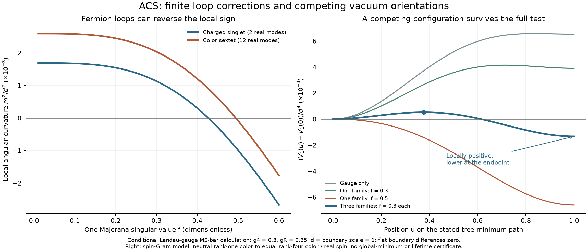

# Radiative lifting and competing ACS vacua

The corrected negative-rho2 branch has a calculable one-loop test. Gauge loops
can lift its remaining flat modes positively; Majorana fermion loops can reverse
the sign. A further result matters for the framework: **positive local masses
do not guarantee that the conventional neutral configuration has the lowest
energy**. An explicit three-family example has positive curvature in all fourteen
physical tree-flat directions and a different, lower-energy configuration.

These are conditional results for specified boundary couplings. They do not
select those couplings, a physical scale, or a unique ACS vacuum.



## Precisely what was calculated

Work at Phi=0 in the canonically normalized 68-real-field action inherited from
the [action-matching audit](../action_matching/README.md). Write

\[
 N=\sum_a\operatorname{Tr}(D_a^\dagger D_a),\qquad
 A=\operatorname{Tr}\big[(\sum_aD_a^\dagger D_a)^2\big],\qquad
 C=\sum_{ab}|\operatorname{Tr}(D_a^\dagger D_b)|^2.
\]

The two explicit old trace readings are
\(V=m_\Delta N+\rho_1N^2+\rho_2A\), or the same expression with C.
Require rho2<0, lambda7=rho1+rho2>0 and mDelta=-2 lambda7 d². At the neutral
configuration D=(1,-i,0)d E44/sqrt(2), N=d². The A model has two physical flat
scalar modes; the C model has fourteen. Both also have nine gauge Goldstone modes.

The scalar-spectrum examples use rho1=.3, rho2=-.1, a positive Phi mass coefficient
1, lambda0=.1 and the norm portal lambda13=.1. Other mixed terms and both
holomorphic terms are zero. These are explicit boundary choices.

The loop potential is in Landau gauge and MS-bar:

\[
V_1=\frac{1}{64\pi^2}\left[
\sum_s x_s^2\!\left(\log\frac{x_s}{\mu^2}-\frac32\right)
-2\sum_W x_W^2\!\left(\log\frac{x_W}{\mu^2}-\frac32\right)
+3\sum_V x_V^2\!\left(\log\frac{x_V}{\mu^2}-\frac56\right)\right],
\]

where x=m² and x² log x=0 at zero. The finite constants are retained, following
[Martin, section 3](https://arxiv.org/html/hep-ph/0111209v2). This is an
effective-potential calculation, not a momentum-dependent pole-mass calculation.

## Flat directions and their finite loop corrections

Let e-=(1,-i,0)/sqrt(2), e+=(1,+i,0)/sqrt(2). The charged spin orbit, present in
both models, is D_a=d(cos(theta)e-+sin(theta)e+)_a E44. The C model also admits
the color orbit D_a=d(e-)_a[sin(theta)E11+cos(theta)E44]. Each stays at a
tree-stationary point with N=d² and has canonical speed squared 2d².

Their curvature is therefore V1''(0)/(2d²). Following the curved stationary
orbit includes the radial tadpole subtraction; a straight-line Hessian without
that subtraction would answer a different question.

The scalar potential and kinetic metric have an accidental unitary symmetry
along each allowed orbit. Exact polynomial Lie derivatives vanish. Independently,
the complete 68-scalar Hessian spectrum is constant along the orbit. Thus the
scalar-loop term makes no angular contribution here. It has not been discarded
as an approximation.

Set T=3g4²+2gR², and let f_i be the Takagi singular values of the symmetric
Majorana matrix F. The charged singlet (two real modes) has gauge curvature

\[
m_{\rm spin,g}^2=\frac{d^2}{8\pi^2}
\left\{g_R^4\!\left[3\log\frac{g_R^2d^2}{\mu^2}+2\right]
-18g_4^2g_R^2\!\left[\log\frac{Td^2}{\mu^2}-\frac13\right]\right\}.
\]

The color sextet (twelve real modes, present as flat modes only in the C model)
has gauge curvature

\[
m_{\rm color,g}^2=\frac{d^2}{8\pi^2}
\left\{3g_4^4-6g_4^2(g_4^2+2g_R^2)
\!\left[\log\frac{Td^2}{\mu^2}-\frac13\right]\right\}.
\]

Both receive the same fermion contribution:

\[
m_F^2=\frac{d^2}{4\pi^2}\sum_i f_i^4
\left[\log\frac{2f_i^2d^2}{\mu^2}-1\right].
\]

The unbroken SU(3)xU(1) makes the curvature degenerate inside each of these two
complex irreducible representations and forbids their quadratic mixing. This
covers all fourteen physical flat directions, not just two arbitrary vectors.
The other physical Delta directions have positive tree masses on this branch.

The vector characteristic polynomials are verified exactly. Independent
component gauge Grams and full 16n-by-16n Weyl matrices reproduce the spectra at
one and three families, including complex non-diagonal F. Derivatives at 70-digit
precision and shrinking-step component differences reproduce the curvature
formulas. The largest final high-precision difference is below 5.4e-12 in the
tested units.

## The matching boundary remains a physical input

Write eta_s=lambda6-lambda7 and eta_c=lambda9-lambda7. Their tree contribution is
4d² eta/3. On the respective flat boundaries,

\[
32\pi^2\beta_{\eta_s}=-108g_4^2g_R^2+18g_R^4+12\operatorname{Tr}[(F^\dagger F)^2],
\]
\[
32\pi^2\beta_{\eta_c}=-36g_4^4-72g_4^2g_R^2+12\operatorname{Tr}[(F^\dagger F)^2].
\]

These expressions agree with the archived exact beta tables, including scalar
and wave-term cancellation. The running tree term cancels the explicit
renormalization-scale derivative of the loop curvature exactly at this order.
Numerical checks vary mu from .5 to 2 while holding a fixed boundary at mu0=1.

The examples set eta(mu0)=0. A finite boundary eta(mu0) shifts the result by
4d² eta(mu0)/3. Choosing a different boundary scale while resetting eta to zero
changes the model; it is not a harmless renormalization-scale change. Neither
the old trace ansatz nor these loop calculations derive that matching condition.

At g4=.3, gR=.35, d=mu0=1:

- With F=0, the spin and color curvatures are +0.001688622 and +0.002591836.
- With one f=.5, they are -0.000991873 and -0.0000886593.
- With three f_i=.3, they are +0.0000175925 and +0.000920806.

On the one-family slice the local signs cross near f=.426753 and f=.494086,
respectively. These values depend on the stated inputs and loop order; they are
not parameter predictions. Near a cancellation, omitted higher orders matter
more to the sign.

## Search the full tree-minimum family

For rho2<0, the sharp bounds A<=N² and C<=N² identify the whole tree-minimum
families. Equality for A forces the positive matrix sum(Da†Da) to have rank one.
Each symmetric Da then has the same rank-one color support. A color gauge rotation
reduces it to E44, leaving precisely the spin orbit above.

For C, flatten each symmetric Da into its ten canonically weighted complex
entries. Equality forces the three-by-ten flattened matrix to have rank one:
Da=v_a S, with S complex symmetric. Takagi factorization reduces S, up to a color
gauge rotation and overall phase, to diag(sqrt(q1),...,sqrt(q4)), q_i>=0 and
sum q_i=1. A phase choice makes the real and imaginary parts of v perpendicular;
real spin rotations align them with two axes. Their relative lengths are
parameterized by theta in [0,pi/4]. The leftover overall phase does not enter
these perturbative mass spectra.

Consequently the complete angular potential on the C tree-minimum family is a
function of three independent q_i and theta. This reduction follows from the
rank condition; it is not an assumption that the two original orbit slices
exhaust all orientations.

The general vector spectrum consists of:

- For each i<j, g4² d²(sqrt(q_i)+sqrt(q_j))² and
  g4² d²(sqrt(q_i)-sqrt(q_j))²: twelve eigenvalues.
- gR² d²(1+sin(2theta)) and gR² d²(1-sin(2theta)).
- Four eigenvalues of the neutral Cartan/R3 matrix recorded in the executable.
- Three massless SU(2)L vectors.

For every f_i, the Weyl squared masses are 2 f_i² d² q_j cos²(theta) and
2 f_i² d² q_j sin²(theta), j=1..4, plus eight zeros per family. Scalar spectra
remain constant across this entire rank-one flattened family. Full component
checks, permutation checks, and the previous two orbit limits all pass.

We ran 768 optimizations: four input cases, each color support cap from one to
four, 16 starts and then 32 fresh starts. Lower-rank faces are included in each
support cap. The larger restart batches reproduce the best values within 1e-9.
The original logs retain **47 abnormal L-BFGS-B stops** in the gauge-only and
one-f=.3 cases. A separate Powell audit retries all 47 original starts. One of
those returns a false numerical success: moving its angle slightly downhill
lowers the potential. Its failed initial audit is preserved under
[attempts/powell-nonstationary](attempts/powell-nonstationary/README.md).
The qualified audit applies SLSQP refinement when a retry loses to its original
returned energy and retains both results. All 47 qualified retries return neutral
energy within 1e-9. These qualifications do not certify global minima.

The gauge-only and one-f=.3 searches return the conventional neutral orbit to
numerical accuracy. The one-f=.5 and three-f=.3 searches find q_i=1/4 and
theta=pi/4 as their best C-model candidates. The A model allows only rank-one
color support; its best candidates in these latter cases lie at theta=pi/4.

## An explicit counterexample independent of the optimizer

For the C model with three f_i=.3, all fourteen leading local flat-mode
curvatures are positive. Compare that neutral configuration with
Da=d delta(a,1) I4/2: q_i=1/4 and theta=pi/4. At the latter point, the vector
squared masses are nine copies of g4²d², two copies of 2gR²d², and ten zeros.
For each family there are eight Weyl squared masses f_i²d²/4 and eight zeros.

The tree energy and scalar-loop spectrum agree exactly between the two points.
An independent closed expression for their gauge-plus-fermion energy difference
gives

\[
\Delta V/d^4=-0.000133189522183369\ldots
\]

at the specified boundary. Direct component matrices and 70-digit evaluation
agree. This exhibits a lower-energy configuration regardless of whether it is
the absolute minimum. The neutral point is locally stable in the leading lifted
subspace yet fails global minimality at that order.

A continuous tree-minimum path connects the points: theta=pi u/4,
q1=cos²(pi u/3), q2=q3=q4=sin²(pi u/3)/3, u in [0,1]. Along this path the
potential first rises, reaching about +5.21284e-5 d⁴ near u=.37630, then falls
below the neutral value. This is an energy-barrier witness, not a least-action
tunneling path or a calculation of vacuum lifetime.

## What this changes in the ACS workflow

The old stability test can now be replaced by an explicit action-based sequence:
check all physical tree modes, lift genuine flat directions with the finite loop
potential and specified matching conditions, then check competing orientations.
Testing only the neutral radial mode, or even all local neutral curvatures, is
insufficient. The calculation also identifies the missing inputs precisely:
finite quartic boundary differences, gauge/flavor couplings and their scale.

This stage closes the conditional one-loop flat-direction calculation. It does
not close finite one-loop matching to a selected light doublet, momentum-dependent
mass corrections, or recovery of an ACS construction that fixes the inputs.
The broader goal remains active.

## Reproduction and evidence

From the repository root, run in order with NumPy, SciPy, SymPy and mpmath:

```sh
python code/condensate_energy/radiative_flat_modes.py
python code/condensate_energy/radiative_vacuum_search.py
python code/condensate_energy/radiative_competing_vacua.py
python code/condensate_energy/radiative_search_audit.py
python code/condensate_energy/seal_radiative_flat_modes.py
```

Set OPENBLAS_NUM_THREADS=1 and OMP_NUM_THREADS=1 for reproducible resource use.
The outputs are [analytic and component results](results.json),
[complete search runs](vacuum-search.json),
[explicit competing configurations](competing-vacua.json),
[optimizer-stop review](search-audit.json), and the [hash receipt](receipt.json).
The [protocol](protocol.md) distinguishes the initial calculation from the
follow-up prompted by the observed competing configuration. Earlier receipts
and their artifacts are verified before this stage is sealed.
