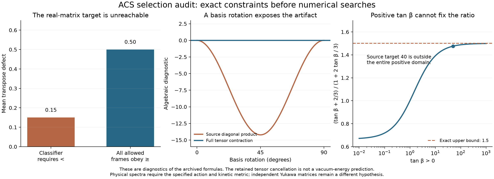

# What the proposed selectors actually select

24 September 2026. **123 checks passed across four audit programs.** These checks establish the qualified results below; they do not certify the archived physical claims. Source files are preserved unchanged, with hashes in `provenance.json`. The full ACS investigation remains active pending source and scope reconciliation.



## 1. The symmetry search excludes its own target

`selection_full.py` evolves eight orthonormal **real** 4×4 matrices and measures compactness using the transpose:

\[
C=\sum_{a=1}^{8}\|B_a+B_a^T\|_F^2.
\]

The antisymmetric real 4×4 subspace has dimension six. The sum of squared projections of eight orthonormal vectors onto it cannot exceed six, so **C≥8**. Since each transpose defect has norm at most two, their mean is at least **1/2**. The classifier requires a mean below **0.15**. That target is impossible in the implemented search domain, independently of run length or random seed.

Closure alone also fails to select the claimed unique algebra. The six strictly upper triangular matrix units plus two diagonal traceless generators form a closed, eight-dimensional solvable algebra. Its derived algebra has dimension six and its Killing form has rank two. Embedded split sl(3) has derived dimension eight and Killing rank eight. These algebras are not isomorphic, yet both close exactly and both have C=20 in the tested normalized bases.

A valid compact su(3) exists using a real span of **complex skew-Hermitian** matrices. Its Killing form is negative definite. This retains the useful forward construction, but requires a different real form and a conjugate-transpose metric. Closure and a stipulated penalty do not provide an action, physical vacuum selector, or mass scale.

Six seeded 20-step replays of `selection_full.py` decrease its combined score but do not reach its impossible compact classifier. Separately, a full replay of `selection_principle.py` produces a closure defect rising from **0.229914 to 0.231579**, contrary to its printed relaxation claim. Its 1% perturbation produces **0.025526**, also contradicting its printed “below 0.01” conclusion. These are source-output discrepancies, not a general theorem about every optimization method.

Evidence: `symmetry-selection.json`, `verification.json`, and source replay logs in `attempts/`.

## 2. An algebraic cancellation is not a vacuum-energy calculation

With the archived T=diag(1/3,1/3,1/3,−1), define

\[
C_{ab}=\operatorname{Tr}([T,B_a]^T[T,B_b]),\quad
K_{ab}=8\operatorname{Tr}(B_aB_b),\quad
G_{ab}=\operatorname{Tr}(B_a^TB_b).
\]

The source's diagonal product \(\sum_a C_{aa}K_{aa}\) vanishes in its paired basis. Rescaling one active generator changes it to **640/3**. Even in an orthonormal basis, rotating an active symmetric generator toward an inactive antisymmetric one gives

\[
\sum_a C'_{aa}K'_{aa}=-\frac{128}{9}\sin^2(2\theta).
\]

The proper full contraction **Tr(G⁻¹KG⁻¹C)=0** survives both changes. That exact algebraic result is retained. Its identification with a physical zero-point energy is not established: determinant weights depend on the action, kinetic metric, statistics and gauge constraints, rather than the sign of an internal Killing form.

For example, the corresponding positive commutator operator has six eigenvalues 16/9 and nine zeros. If these were independent positive oscillators, their zero-point energy would be four in ħ=1 units. This is a diagnostic counterexample, not an identification of the ACS particle spectrum. Conversely, the explicit opposite-kinetic oscillator H=H₁−H₂ has energies unbounded below; its formal cancellation does not define a lowest-energy vacuum.

The printed residual proportional to a mass-squared splitting has mass dimension two where the source labels an energy density of dimension four. The derivative of the scalar one-loop term contains an additional mass-squared factor. The source's own comparison `(0.05 eV)^4/(0.0023 eV)^4` exceeds 100,000, rather than lying within two orders of magnitude.

## 3. The full action retains a vacuum-energy input

The inherited complete scalar action has 68 real canonical fields and quadratic terms

\[
m_0 N_\Phi+m_1\Re\det\Phi+m_2\Im\det\Phi+m_d N_\Delta.
\]

Here every m has mass dimension two. At the field origin the scalar mass-squared eigenvalues are \(m_0\pm\tfrac12\sqrt{m_1^2+m_2^2}\), each fourfold, and \(m_d\), sixtyfold. Thus

\[
\beta_\Omega=\frac{8m_0^2+2m_1^2+2m_2^2+60m_d^2}{32\pi^2}.
\]

This term **already exists** in the archived `full_one_loop_rg.py`. This audit independently reconstructs it from the 68-component Hessian, checks spectra at five regular positive-mass points, and verifies scale cancellation independently at 80-digit precision at three more points. The scalar one-loop convention agrees with [Martin's effective-potential formulas](https://arxiv.org/html/hep-ph/0111209v2). No supersymmetric beta function is imported into this action.

The running fixes a derivative, not an initial value:

\[
\Omega(\mu)=\Omega(\mu_0)+\int_{\log\mu_0}^{\log\mu}\beta_\Omega(t)\,dt.
\]

Adding a constant to a flat-space potential leaves its field equations, stationary points and Hessian unchanged. With gravity that constant affects geometry, but its value still requires a specified matching or boundary condition. Neither the algebraic cancellation nor this RG equation supplies that condition. A broken-vacuum supertrace must not be confused with this field-independent counterterm.

## 4. Use the actual gauge action

Commuting with T alone does not make T the photon generator. In the inherited bidoublet/triplet action the neutral vacuum is annihilated by

\[
Q=T_{3L}+T_{3R}+\tfrac12T_{B-L},
\]

whereas \(T_{B-L}\) alone acts nontrivially on Δ. Independently deriving the charged gauge kinetic block gives

\[
M^2_{\rm charged}=\begin{pmatrix}
g_L^2(v_u^2+v_d^2)/4&-g_Lg_Rv_uv_d/2\\
-g_Lg_Rv_uv_d/2&g_R^2[d^2+(v_u^2+v_d^2)/4]
\end{pmatrix}.
\]

There is no separate extra “torsion W mass” in that action. An additional torsion sector would require its own fields and kinetic terms. The older source's proposed additions also yield a torsion fraction **2/7 of the total**, although the ratio to its Higgs contribution is 2/5. Those are different denominators. The later Higgs-wall source already qualifies that older construction as conditional.

## 5. The proposed large-tan-beta repair fails its own formula

`acs_higgs_wall.py` proposes \(R(t)=(t+2/3)/(1+2t/3)\). Over its stated positive domain,

\[
\frac23<R(t)<\frac32;\qquad R(50)=\frac{152}{103}.
\]

It cannot produce the source's target ratio of 40. The scalar formula can reach 40 at a **negative** relative VEV, t=−118/77, which changes the proposed domain.

There is a stronger, separate matrix constraint. If \(\widetilde Y=(2/3)Y\), both Dirac mass matrices are scalar multiples of the same matrix. Their left mass squares commute, all generation ratios are identical, and there is no physical mixing among nondegenerate masses. Changing a scalar relative phase does not fix that alignment.

A **norm-only** relation between two otherwise independent matrices is a different hypothesis. An explicit noncommuting example satisfies the same norm ratio, so the proportionality obstruction does not exclude it. Its matrix orientations and flavor data remain inputs. No new fit to measured quark masses or mixing was performed.

Evidence: `yukawa-boundary.json` and the unchanged source replay.

## Reproduction and scope

Run from the checkout with NumPy, SciPy, SymPy, mpmath and Matplotlib available:

```sh
OPENBLAS_NUM_THREADS=1 OMP_NUM_THREADS=1 python code/condensate_energy/symmetry_selection_audit.py
OPENBLAS_NUM_THREADS=1 OMP_NUM_THREADS=1 python code/condensate_energy/vacuum_energy_audit.py
OPENBLAS_NUM_THREADS=1 OMP_NUM_THREADS=1 python code/condensate_energy/verify_selection_energy.py
OPENBLAS_NUM_THREADS=1 OMP_NUM_THREADS=1 python code/condensate_energy/yukawa_selector_boundary.py
python code/condensate_energy/publish_selection_energy.py --render-only
```

The four result sets contain 38, 45, 19 and 21 checks. A failed first projector construction is preserved in `attempts/projector-shape/`; its corrected result is the one reported here. Successful command output and unmodified source replays are preserved too. `receipt.json` hashes this stage and independently verifies the preceding sealed chain.

This stage closes the specific selector/cancellation/repair arguments above. It does not establish a cosmological constant, physical mass scale, RH result, universal obstruction to compact models, or impossibility of an independently specified ACS action. The remaining work is to reconcile the source inventory with prior evidence and identify any surviving action-level input derivation before claiming the full goal complete.
