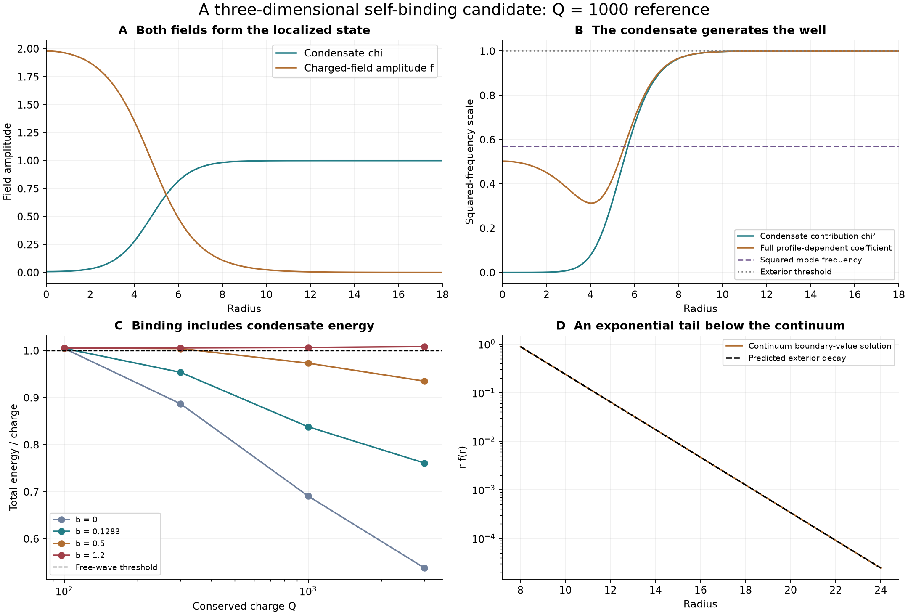
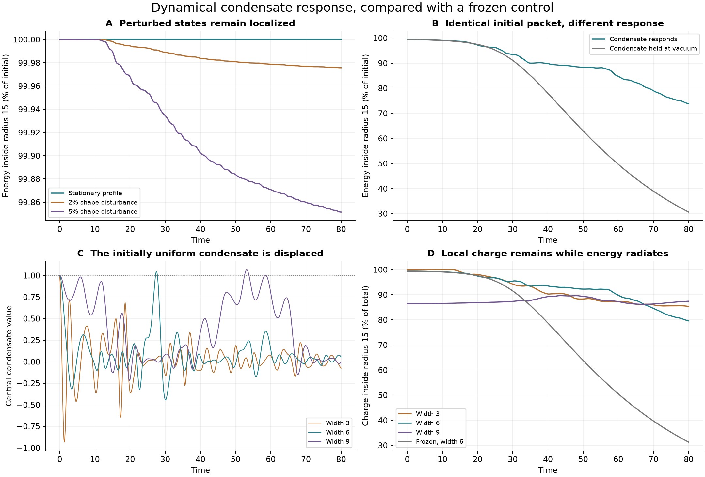

# A conditional self-binding mechanism for the ACS investigation

2026-09-23. Status: **numerically qualified reduced model; ACS identification open**.

We found a three-dimensional model in which a charged field depletes a
condensate, produces its own interior well, and forms a localized rotating
state with less energy than free charged waves carrying the same charge.
Both fields' gradient, kinetic and potential energies are included. This is
a concrete candidate for the missing binding mechanism, not a derivation of
matter, particle masses, or the full ACS action.

The mechanism is related to the established Friedberg–Lee–Sirlin soliton:
a real scalar's vacuum value gives a complex scalar an exterior mass, while
the localized state displaces that real scalar. Our model adds an explicit
nonnegative complex-field quartic. See Heeck and Sokhashvili,
[Revisiting the Friedberg–Lee–Sirlin soliton model](https://arxiv.org/html/2303.09566v2).
The numerical results below are our own experiments.

## Why this succeeds where the previous barrier did not

The earlier exclusion applied to a nonnegative compact barrier with a
massless exterior. This model has a nonzero propagation threshold throughout
the exterior vacuum. A frequency below that threshold can have an
exponentially decaying tail. Inside, the condensate responds locally to the
charged field rather than following a prescribed gate schedule.

Conserved charge supplies the other requirement. Its associated internal
rotation contributes energy inversely proportional to the field's integrated
squared amplitude. Minimizing at fixed charge balances this term against the
cost of gradients and condensate deformation. This is outside the assumptions
of the static real-scalar Derrick obstruction. No negative Hamiltonian term,
external work, damping, or evolving renormalization is used.

## Explicit model and binding criterion

For real condensate \(\chi\), complex field \(q=\sqrt2\Psi\), and chosen
dimensionless coefficients \(v=g=\lambda_\chi=1\):

\[
E=\int_{\mathbb R^3}\left[
\frac{|q_t|^2+|\nabla q|^2+\chi_t^2+|\nabla\chi|^2}{2}
+\frac{(\chi^2-1)^2}{4}+\frac{\chi^2|q|^2}{2}
+\frac b4|q|^4\right]d^3x,
\qquad Q=\int\operatorname{Im}(\bar q q_t)\,d^3x.
\]

The equations evolved are

\[
q_{tt}=\Delta q-\chi^2q-b|q|^2q,\qquad
\chi_{tt}=\Delta\chi-\chi(\chi^2-1)-\chi|q|^2.
\]

The vacuum is \((\chi,q)=(1,0)\), with exterior charged-wave mass
\(m_\infty=1\). For \(q=f(r)e^{i\omega t}\), let
\(I=4\pi\int r^2f^2dr\). Then \(Q=\omega I\) and the fixed-charge
functional is \(E_Q=G+V+Q^2/(2I)\), where \(G\) includes both gradients
and \(V\) the complete potential.

**If \(E<m_\infty|Q|\), complete dispersal into free charged waves of that
conserved charge is energetically forbidden.** This alone does not exclude
fission, every nonlinear disturbance, or quantum decay.

There is an exact negative control. With general positive coefficients,

\[
U-\frac{g^2v^2f^2}{2}
=\frac{\lambda_\chi}{4}
\left[(\chi^2-v^2)+\frac{g^2}{\lambda_\chi}f^2\right]^2
+\frac14\left(b-\frac{g^4}{\lambda_\chi}\right)f^4.
\]

Consequently \(b\ge g^4/\lambda_\chi\) implies
\(E\ge gv|Q|\). In our units, \(b\ge1\) cannot have the claimed
energy advantage. The tested \(b=1.2\) cases obey this bound.

## Stationary evidence

The frozen survey contains four quartics, four charges and two initial
profile widths: **32 optimizations**, with every outcome retained. At
\(Q=1000\), the lower-energy results have \(E/Q\) approximately 0.6910
for \(b=0\), 0.8381 for \(b=0.1283\), 0.9734 for \(b=0.5\), and
1.0066 for the no-binding control \(b=1.2\). Low-charge diffuse finite-box
states also occur; the survey does not support a claim that every input binds.
Survey profiles are approximate. The following reference received the full
stationarity and independent-method qualification.

For \(b=2\sqrt3/27\), \(Q=1000\), an independent continuum radial
boundary-value solve gives:

- **Total energy 838.163096**, versus the free-wave threshold 1000:
  **16.1837% binding margin**.
- Frequency **0.754888212**, below the exterior threshold 1.
- Maximum boundary-value RMS residual \(9.91\times10^{-8}\), and relative
  virial residual \(2.99\times10^{-10}\).
- Predicted tail exponent \(\sqrt{1-\omega^2}=0.655853480\); fit to
  \(\log(rf)\) over radii 15–20 gives **0.655853649**.
- Finite-volume refinement from spacing 0.1 to 0.05 moves energy from
  838.131320 to 838.155154. The fine-grid relative discrepancy from the
  continuum result is \(9.48\times10^{-6}\).
- Increasing domain radius from 30 to 40 at fixed spacing changes energy
  by only \(2.44\times10^{-15}\) relative.



The fixed-charge amplitude Hessian has no negative eigenvalue in the tested
radial, dipole and quadrupole sectors. Fine-grid lowest eigenvalues are
approximately 0.399347, \(9.30\times10^{-6}\), and 0.158962. The dipole
value falls by approximately four under halving of grid spacing, consistent
with the expected translation zero mode. The phase zero mode is approximately
\(2.19\times10^{-13}\). Higher angular sectors add positive centrifugal
terms. These checks concern this scalar model's linear energetic stability;
they do not include additional ACS scalar or gauge directions.

### Preserved numerical failure

The initial optimizer stopped on energy change before its coarse and fine
reference gradients reached the preregistered \(10^{-5}\) tolerance. Its
failure and all raw outcomes remain in `attempts/20260923T220707250253Z/`
and `latest-attempt.json`. No tolerance or physical parameter was relaxed.
An exact-Hessian Newton refinement brought all three reference gradients to
roughly \(10^{-12}\), changing energies by less than \(1.8\times10^{-10}\).
See [the recorded amendment](numerical-amendment.md). The approximate survey
was not relabeled as fully qualified.

## Dynamics and formation tests

Ten evolution/control runs test the stationary reference through dimensionless
time 80 on a radius-120 domain. These use conservative velocity Verlet with
both fields evolving, except the explicitly frozen-condensate control.
Energy and charge inside radius 15 are measured relative to initial totals.

- A 2% radial shape perturbation retains **99.9757%** of initial energy
  locally; a 5% perturbation retains **99.8515%**.
- The largest relative energy drift across the ten cases is
  \(6.96\times10^{-6}\); largest relative charge drift is
  \(2.62\times10^{-15}\). Refinement changes the tested local-energy
  curves by at most \(2.85\times10^{-5}\) of initial energy.
- Charge-sign reversal and constant phase shift preserve energy observables;
  vacuum remains vacuum. Energy in the distant boundary zone stays negligible.
- A zero-charge control retains 53.82% locally at time 80. This finite-time
  residence prevents claiming that uncharged configurations disperse
  immediately; it has no fixed-charge binding guarantee.

Five additional runs start from **uniform condensate**, with charged Gaussian
packets of widths 3, 6 and 9, plus a refinement and a matched frozen control.
The amplitude is set once to \(Q=1000\), with initial \(q_t=iq\).
These are prepared charged packets, not spontaneous creation from vacuum or
arbitrary incident radiation.

At time 80, the three widths retain respectively **67.49%, 73.84%, and
86.08%** of their initial energy inside radius 15. The width-6 frozen control
starts with the **same field, charge and energy**, but retains **30.62%**.
The corresponding local charge fractions are 79.59% with condensate response
and 31.28% when frozen. This matched comparison isolates the contribution of
condensate response to retention.

The width-6 refinement gives 73.8405% versus 73.8352% at the endpoint; the
maximum local-energy curve discrepancy is 0.0368 percentage points.
Maximum energy drift across these five runs is \(5.05\times10^{-6}\).
The trajectories still oscillate: finite-time retention is not proof of
asymptotic relaxation into a stationary soliton.



## What is still missing from ACS

The ACS sources contain symmetry-breaking scalar potentials and norm
cross-couplings that motivate this experiment. They do not yet uniquely
derive its field assignments, protected charge, canonical coefficients or
physical scale. The reference value \(b=2\sqrt3/27\) is an inspired test
input, not a demonstrated reduction of the full action.

A specific attempted charge assignment fails. Identifying the complex field
with the Higgs bidoublet's overall phase while keeping both displayed generic
Yukawa couplings requires

\[
-q_L+q_\Phi+q_R=0,\qquad -q_L-q_\Phi+q_R=0,
\]

which forces \(q_\Phi=0\). Thus that assignment cannot provide the
nonzero conserved scalar charge used here. This does not exclude another
collective or component symmetry, or a gauge completion; each needs an
explicit transformation law and the complete interactions. The full analysis
and source locations are in [the source-to-model map](source-map.md).

The next derivation is therefore well specified: identify a surviving charge
in the complete ACS action, match the kinetic and potential normalization,
and test this localized branch with every permitted coupling restored. If
the charge is approximate, measure its leakage and the resulting lifetime
instead of applying an exact-charge energy bound. A gauge completion also
requires its gauge-field energy and constraints. Classical continuous charge
does not supply elementary-particle mass quantization. The present work does
not yet implement Klein-foam gluing or derive its action.

## Reproducibility and evidence record

There are **23 numerical checks and 5 symbolic checks** in the qualified
record. Passing numerical checks means the registered conservation,
resolution and solver requirements passed; it is not a universal stability
theorem. `assessment.json` summarizes results, and `receipt.json` records
SHA-256 digests for scripts, protocols, raw data and figures. The summarizer
also verifies that prior condensate, capture-stability and autonomous-gate
receipts remain unchanged.

Run the following from the repository root, using an environment with NumPy,
SciPy, SymPy and Matplotlib. Run each command separately: the original survey
may return nonzero for its preserved stationarity failure, which is then
handled by the documented refinement.

```sh
OPENBLAS_NUM_THREADS=1 OMP_NUM_THREADS=1 python code/condensate_energy/self_binding.py
OPENBLAS_NUM_THREADS=1 OMP_NUM_THREADS=1 python code/condensate_energy/self_binding_polish.py
OPENBLAS_NUM_THREADS=1 OMP_NUM_THREADS=1 python code/condensate_energy/self_binding_dynamics.py
OPENBLAS_NUM_THREADS=1 OMP_NUM_THREADS=1 python code/condensate_energy/self_binding_formation.py
python code/condensate_energy/self_binding_contract.py
python code/condensate_energy/summarize_self_binding.py
```

Recorded environment: Python with NumPy 2.5.0, SciPy 1.18.0, SymPy 1.14.0,
and Matplotlib 3.11.2. Protocols were recorded before their respective runs.
Existing manuscripts, source actions and standing-rule files were not changed.
