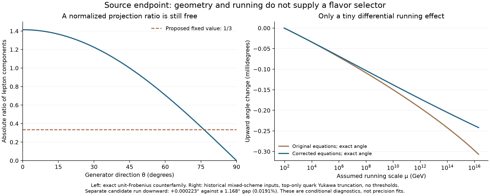

# Remaining source proposals: algebra, units and running

24 September 2026. The twelve previously unmatched entries in the targeted
36-file action/input inventory are now preserved and reconciled. **None of these
twelve supplies the missing physical normalization, vacuum or flavor selector.**
This is a disposition of the specified sources, not an exhaustive claim about
every file, archive or cloud conversation.

There are **52 passing checks**: 33 algebra/unit/replay checks and 19 running and
replay checks. Ten historical programs complete; the other two entries are
executable duplicates. A successful replay establishes what a program does,
not whether its printed scientific interpretation follows.



## Projection does not fix the neutrino suppression

For real matrices, the map J(X)=i sym(X)+anti(X) preserves the Frobenius norm.
Thus applying J before taking these norms cannot create a hierarchy absent in
the original norms. The exact identities [sym,anti]⊂sym and [sym,sym]⊂anti
survive. The printed claim that the first bracket has comparable symmetric
and antisymmetric parts does not. This vector-space construction is not a Lie
homomorphism of the split real algebra: for noncommuting symmetric S,T,
[JS,JT]=−J[S,T].

An explicit normalized counterfamily is

    f₁=S₀₃/√2,  g=A₀₃/√2,
    f₂=(cos θ H₀₃+sin θ H₁₂)/√2.

Here S has symmetric unit off-diagonal entries, A the antisymmetric entries,
and H the indicated +1,−1 diagonal entries. All three matrices have unit
Frobenius norm. The ratio of the absolute 44-components of [[f₁,f₂],f₁] and
[f₁,g] is √2|cos θ|. It varies continuously from zero to √2; it is not fixed
at 1/3. For T=diag(1/3,1/3,1/3,−1), the lepton squared-projection fraction is
3/4 and the color fraction is 1/4. Their ratio is 1/3, but identifying that
ratio with a Yukawa suppression needs an additional coupling map. The direct
sum 4=3⊕1 is not a tensor-product factorization defining a partial trace.

Internal gauge neutrality also does not imply trivial Lorentz transformation.
A Weyl spinor can have zero internal charge while its spin rotation acts
nontrivially. Bracket parity alone therefore does not force a neutrino's
physical Yukawa interaction to arise at the asserted extra order.

The replayed neutrino estimates expose two unit mistakes:

- `neutrino_exact.py` computes mₑ²/(3mτ) with masses in MeV, then multiplies
  by 1,000 while labeling the answer eV. The correct result from those inputs
  is **48.9853 eV**, not 0.0489853 eV.
- `neutrino_seesaw_v2.py` describes ε×0.511 MeV, ε=2.87×10⁻⁴, as about
  0.147 eV. It is **146.657 eV**. Its numerical table and static conclusion
  disagree. No new experimental mass comparison is implied here.

The 5,000-pair `neutrino_seesaw.py` replay reports a typical norm ratio above
one, despite its prose calling this suppression in the right direction. An
assumed Majorana mass can still implement a conditional seesaw. The separate
`neutrino_honest.py` version differs from the [previously audited source](../finite_matching/README.md)
only by license comments; its scale is calculated from an inserted target.

## Repairing the running diagnostic does not close the angle gap

The historical `koide_rg_flow.py` initializes the ordinary hypercharge coupling
but uses a GUT-normalized coefficient and an additional conversion. It also
adds 4.5 yₜ² to a trace already containing 3 yₜ², double-counting that part of
the top self-term. The corrected diagnostic uses a consistent hypercharge
convention and the one-loop equations in [Antusch et al., Appendix D](https://arxiv.org/html/hep-ph/0501272v3).
All quark Yukawas except the top and all neutrino Yukawas are set to zero.

The initial numbers are deliberately the source's historical, mixed-scheme
inputs, with MZ=91.1876 GeV and an assumed upper scale 2×10¹⁶ GeV. This isolates
the equation repairs; it is not a precision Standard Model fit. Thresholds and
new physics are absent. A second integration in the properly converted GUT
convention agrees. Two integration methods agree to 1.08×10⁻¹² in the state;
closed gauge solutions, reverse integration and an independent integrated
flavor-ratio equation also pass.

We extract the three-amplitude Fourier angle exactly, retaining the radius
as an independent coordinate. The source's fixed-radius fit shifts the angle
by more than the running effect and can reverse its apparent sign. With the
exact coordinates, the input angle is 12.7328199671° and the corrected upward
run ends at 12.7325780815°. Flavor-universal running cancels from the angle
identically; only differential running can move it.

Starting from the historical candidate π/6−atan(1/3)=11.5650511771° at the
upper scale and running down gives **11.5652741486°**. Its shift is
**0.0002229715°**, compared with the required **1.1677687900°**: about
**0.01909% of the gap**. Repairing the equations and extraction restores the
direction in this diagnostic, but leaves the magnitude far too small.
The candidate itself was not derived in the source.

The full 10,000-pair `koide_clebsch_gordan.py` replay and the separate Cabibbo
script remain exploratory fits. The Cabibbo replay inserts λ=0.2265 and a
lepton normalization, producing a 2.66% electron-mass mismatch with its own
comparison input. It does not derive λ. The ordinary positive-mass Koide
condition Q=2/3 means a 45° angle to (1,1,1); the source's alternate cone-angle
interpretation is not that identity.

## QCD, scalar normalization and the Lagrangian boundary

Both `quark_koide_gut.py` variants have identical executable syntax. Their
one-loop alpha formula puts the coefficient for log μ² in front of log μ;
the mass-running exponent is also half the canonical one-loop exponent.
The scale convention can be checked against the [PDG QCD review, §9.1.1](https://pdg.lbl.gov/2025/reviews/rpp2025-rev-qcd.pdf).
Separately and exactly, common multiplication of all three masses leaves
Koide Q unchanged. The source's high-scale QCD-only scan is consequently flat
once all source masses have been evolved into the common range: Qup≈0.8519103
and Qdown≈0.7331482. Mixed low-scale inputs do not form a precision comparison;
the script's exploratory Yukawa correction is not a validated two-loop fit.

In `higgs_potential.py`, rescaling the same generator rays by a changes the
candidate quadratic to 4a²−8a⁴ and quartic to 64a⁶. The quadratic changes sign
between a=1/2 and a=1. Without the action's kinetic and coefficient
normalizations, this does not select electroweak breaking. For
V(r)=−μr²+λr⁴ and kinetic term (∂r)²/2, the stationary curvature is 4μ,
not the displayed 2μ. A different kinetic metric requires an explicit field
conversion as well. The radial `branch_a_vacuum.py` reconstruction inverts
the same matrix used to insert the target VEVs; it is calibration. Its radial
test does not supersede the [complete scalar spectrum](../action_matching/README.md).

The literal color tensor product printed in `task2_lagrangian.py`,
bar4⊗10⊗4, transforms nontrivially under the SU(4) center and contains no
singlet. The charge-conjugated Majorana contraction must use consistent
representations; the valid complete-action convention remains available.
Canonical graviton expansion also contains a dimension-five cubic operator
h(∂h)² with a negative-mass-dimension coupling. Merely displaying a covariant
dimension-four density does not establish the claimed renormalizability of
gravity. Neither observation invalidates the separately audited flat-space
matter invariant basis.

## Evidence and scope

[Inventory reconciliation](inventory-reconciliation.json) maps all 36 listed
paths to preserved bytes and the responsible report. [Algebra results](algebra.json)
and [running results](running.json) retain every check. [Provenance](provenance.json)
lists the twelve added snapshots. Source stdout, stderr and execution records
are under `attempts/`. Two plotting programs receive only a recorded output-path
substitution in their replay copies; their mathematics and original snapshots
are unchanged. The two executable duplicates are not counted as independent
scientific evidence.

The [receipt](receipt.json) verifies this stage and the preceding evidence
chain. The original ACS goal still requires an integrated scope/carrier audit;
this report does not claim general complex-flavor matching, an all-archive
mathematical review or physical particle identification.

Reproduce from the repository root with the existing Python environment:

```text
code/condensate_energy/source_endpoint_algebra.py
code/condensate_energy/source_endpoint_running.py
code/condensate_energy/publish_source_endpoint.py --render-only
code/condensate_energy/publish_source_endpoint.py --seal
```

Use one BLAS/OpenMP thread. Before resealing a regenerated figure, inspect it
and record its new hash in `visual-review.json`.
