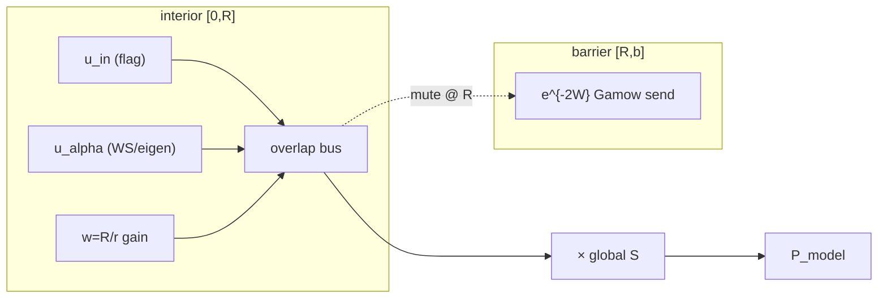

> **Co-governed and enforced under the [Sovereign Integrity Protocol License (SIP License v1.1)](https://github.com/tensorrent/ACS-Framework/blob/main/LICENSE)**

# Refined \(P_\alpha\) Overlap: Parametric Spectroscopic Factor and Self-Consistent WS+Coulomb Eigenmode

**ACS Theoretical Physics Working Group**  
Sovereign-Stack ACS Research Program & Flag Condensate Project  
Date: July 23, 2026

---

## Abstract

Two comparison channels extend the throat+Woods–Saxon overlap proxy on the same 14-isotope set.

- **Channel A** — per-isotope \(S_i=P_{\alpha,\mathrm{ext}}/P_{\mathrm{model},i}\) (diagnostic), global \(S\), and parametric \(\log_{10}S(A,Z)\) / \(\log_{10}S(R)\) with leave-one-out (LOO) RMS.
- **Channel B** — self-consistent \(\ell=0\) eigenmode of \(V_{\mathrm{WS}}+V_C\) on \([0,R]\) (Dirichlet; \(V_0\) so \(E_0=Q_\alpha\)), overlapped with the throat-weighted flag mode.

**Result (non-tautological):** parametric \(S(A,Z)\) LOO RMS \(=0.2862\) reduces residuals most (vs throat+WS global-\(S\) RMS \(=0.8247\)). Eigenmode raises Pearson \(r\) to \(+0.9676\) but leaves global-\(S\) RMS essentially unchanged (\(0.8257\)). RC1: documented proxies — not uniqueness.

---

## Radial track layout (DAW metaphor)

> **Figure:** the compiled PDF includes TikZ Figure `fig:daw-tracks` (§Radial track layout). This section is an ASCII/mermaid fallback.

Horizontal axis \(r\) acts as timeline: origin \(\to\) interior \([0,R]\) \(\to\) barrier \([R,b]\). Each lane is one factor in the throat-weighted overlap integrand (layout aid only—not a literal audio claim).

| Lane | Role | Notes |
|------|------|-------|
| \(u_{\mathrm{in}}\) | Flag interior | Standing wave; **mute @ \(R\)** (Dirichlet) |
| \(u_\alpha\) | Alpha trial / eigenmode | Channel B WS+Coulomb eigenmode |
| \(w(r)=R/r\) | Throat gain automation | AdS-like measure factor |
| Overlap bus | \(w\,u_{\mathrm{in}}u_\alpha\) | Integrate on \([0,R]\) |
| \(\mathrm{e}^{-2W}\) | Gamow send | Fade past \(R\) (Channel C) |

**Mix metaphor (RC1):** global \(S\) = master fader on \(P_{\mathrm{model}}\); parametric \(S(A,Z)\) = clip automation (Channel A, LOO); Dirichlet @ \(R\) mutes interior lanes; Gamow @ \(R\) routes exterior send.



```
  Global S │ master fader
  ─────────┼──────────────────────────────────────────► r
           │ 0        interior [0,R]        R    [R,b]  b
  u_in     │ ∿∿∿∿∿∿∿∿∿∿∿∿∿∿∿∿∿∿∿∿∿∿∿∿∿∿∿│mute
  u_α      │     ╱╲    eigenmode curve    │╲
  w=R/r    │ ▂▂▂▂▂▂▂▂▂ automation ───────│▁
  overlap  │     ▓▓▓▓ shaded product     │
  e^{-2W}  │ ────────────────────────────│▁▂▃ fade/send
           │ S(A,Z) clip automation ─────┘
```

---

## Channel A — isotope \(S\) and parametric models

Base: throat+WS (`palpha_overlap_throat.py`).

\[
S_i=\frac{P_{\alpha,\mathrm{ext}}^{(i)}}{P_{\mathrm{model},i}}
=10^{\log_{10}P_{\mathrm{ext}}-\log_{10}P_{\mathrm{model}}}.
\]

Per-isotope \(S_i\) zeros that isotope’s residual by construction — diagnostic only. Predictive protocols:

1. Global \(S_\star=10^{\langle\log_{10}P_{\mathrm{ext}}-\log_{10}P_{\mathrm{model}}\rangle}\)
2. \(\log_{10}S=b_0+b_1 A+b_2 Z\)
3. \(\log_{10}S=c_0+c_1 R\)
4. Leave-one-out RMS on predicted \(\log_{10}(S P_{\mathrm{model}})\) vs extracted \(\log_{10}P\)

### Numbers (stated set)

| Quantity | Value |
|----------|------:|
| \(\langle S_i\rangle\) | \(1.001\times10^{-1}\) (\(\sigma=1.260\times10^{-1}\)) |
| \(\langle\log_{10}S_i\rangle\) | \(-1.4979\) (\(\sigma=0.8558\)) |
| Global \(S_\star\) | \(3.178\times10^{-2}\) |
| RMS (global \(S\)) | \(0.8247\) |
| LOO RMS \(S(A,Z)\) | \(0.2862\) |
| LOO RMS \(S(R)\) | \(0.4695\) |

Fit: \(b_0\approx14.616\), \(b_1\approx+0.0979\), \(b_2\approx-0.4312\); \(c_0\approx48.503\), \(c_1\approx-5.435\,\mathrm{fm}^{-1}\).

---

## Channel B — self-consistent WS+Coulomb eigenmode

Solve on \([0,R]\) with Dirichlet \(u(0)=u(R)=0\):

\[
-\frac{\hbar^2}{2\mu}\,u''+\bigl[V_{\mathrm{WS}}(r;V_0)+V_C(r)\bigr]u=E\,u,
\]

with \(R_{\mathrm{WS}}=r_0 A_d^{1/3}\), \(a=0.55\,\mathrm{fm}\), uniform-sphere Coulomb for \(r<R_C=R_{\mathrm{WS}}\). Depth \(V_0\) fitted so \(E_0=Q_\alpha\) (box-resonance surrogate). Overlap with \(u_{\mathrm{in}}=r\,j_0(\pi r/R)\) uses throat weight \(w=R/r\).

**BC note.** Dirichlet at throat wall \(R\) matches confined-flag overlap support. Outgoing Coulomb/Gamow matching on \([0,b]\) remains open.

### Numbers (stated set)

| Quantity | Value |
|----------|------:|
| \(\langle\log_{10}P_{\mathrm{model}}\rangle\) | \(-0.1110\) |
| Pearson \(r\) | \(+0.9676\) |
| RMS raw | \(2.0237\) |
| Global \(S_\star\) | \(1.421\times10^{-2}\) |
| RMS (global \(S\)) | \(0.8257\) |

Typical \(V_0\sim36\)–\(43\,\mathrm{MeV}\) on this set.

---

## Acceptance comparison

| Channel | \(\langle\log_{10}P\rangle\) | \(r\) | RMS raw | RMS global \(S\) | LOO RMS param \(S\) |
|---------|-----------------------------:|------:|--------:|-----------------:|--------------------:|
| flat Gaussian | \(-0.3905\) | \(+0.8882\) | \(1.7705\) | \(0.8220\) | — |
| throat + WS | \(-0.4607\) | \(+0.8875\) | \(1.7099\) | \(0.8247\) | — |
| refined eigenmode | \(-0.1110\) | \(+0.9676\) | \(2.0237\) | \(0.8257\) | — |
| parametric \(S(A,Z)\) on throat+WS | (base) | — | — | \(0.8247\) | **\(0.2862\)** |
| parametric \(S(R)\) on throat+WS | (base) | — | — | \(0.8247\) | \(0.4695\) |

### Winner (non-tautological)

**Channel A parametric \(S(A,Z)\)** — LOO RMS \(0.2862\) vs global-\(S\) RMS \(\approx0.82\). Channel B improves correlation (\(\Delta r\approx+0.080\)) but does not reduce global-\(S\) RMS vs throat+WS (\(\Delta\approx+0.001\)).

---

## Artifacts

- Code: `rh_papers_may21/acs-framework/code/palpha_overlap/palpha_overlap_refined.py`
- JSON: `rh_papers_may21/acs-framework/docs/palpha_overlap_refined_results.json`
- Logs: `rh_papers_may21/acs-framework/docs/palpha_overlap_refined_logs/`
- Baselines retained: `palpha_overlap.py`, `palpha_overlap_throat.py`

---

## Conclusion

Predictive parametric \(S(A,Z)\) with leave-one-out compresses residual RMS from \(\sim0.82\) to \(0.286\) on the stated set. Self-consistent WS+Coulomb interior eigenmode improves correlation but does not beat throat+WS on global-\(S\) RMS under the documented Dirichlet/\(E_0=Q_\alpha\) protocol. Open: Gamow outgoing BC; barrier-supported flag amplitude; microscopic spectroscopic factors. Absolute uniqueness is not claimed.
